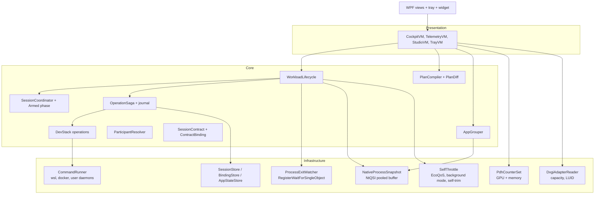

# SessionPilot 1.1 implementation plan

Source: the 1.1 brief and the design discussion behind it (section 3.1), checked against build 1.0.2, `sessionpilot-overview.md`, and `docs/SessionPilot_Project_Specification.txt` on 2026-10-10. Baseline: `dotnet test SessionPilot.slnx` passes 156 tests.

This plan is written for an agent working phase by phase in Cursor. Read **How to work** and **Decision gates** once. Then read only the phase you are on.

---

## Contents

1. How to work
2. Decision gates (owner sign-off before Phase 1)
3. Corrections to the brief, and positions on the design discussion
4. Target architecture
5. Phases 0–9
6. Technical specifications
7. Cursor prompts
8. Verification and testing strategy
9. Finding → item index
10. Status, new findings, blockers

---

## 1. How to work

### Ground rules

- `.cursor/rules/sessionpilot-guardrails.mdc` applies unless a decision gate below changes it. A gate is changed only in Phase 0, by the owner, and the rule file is edited in the same PR. Until then, nothing in this plan enables a forbidden write.
- Do not invent INI keys, CLI switches, JSON import endpoints, registry locations, SteamVR keys, or reload behavior. Section 3 lists switches the brief assumed that do not exist.
- The repository is **public**. Never commit secrets, a real `prolasso.ini` or its values, a Windows profile path with a user name, real container or distro names from the owner's machine, or machine-specific output. Fixtures use synthetic data.
- Match the surrounding code: file-scoped namespaces, `sealed record` DTOs, plain status strings such as `not-measured`, and short declarative user-facing sentences that say what did *not* happen ("Nothing was written.").
- `TreatWarningsAsErrors` is on. A build warning is a failure.
- Performance numbers in docs or UI are measured on a named machine with the command that produced them. Targets in this plan are **provisional targets to validate**, not facts.

### Testing

- Run `dotnet test SessionPilot.slnx --nologo` before every push. All tests pass. The count never drops below the previous phase's count.
- Every bug fix gets a regression test. Write the test first when practical.
- The test project targets `net10.0` and cannot reference WPF. Logic that needs tests lives in `SessionPilot.Core`, `SessionPilot.Infrastructure`, or the new `SessionPilot.Presentation` (Phase 4). The WPF window stays thin.
- Default tests never start real `wsl`, `docker`, `ollama`, `powercfg`, GUI processes, or PDH/DXGI queries, and never touch `ProgramData\ProcessLasso`. Use seams (`ICommandRunner`, `IProcessSnapshotSource`, `IGpuCounterSource`, `IProcessExitSource`, `IClock`, and the existing ones).
- Live tests are opt-in: `[Trait("Category", "Live")]`, skipped unless `SESSIONPILOT_LIVE_TESTS=1`. CI never sets it.
- After a phase that changes the WPF app, build it with `dotnet build src/SessionPilot.App/SessionPilot.App.csproj` and launch it once. Record anything you could not verify in the PR body.

### Repository management

- One branch and one PR per phase: `feat/phase-N-short-name` from up-to-date `main`.
- Commit messages: one plain-English sentence ending with a period.
- Push once when green locally. Open the PR with what changed, the test count before and after, the item IDs closed, and anything not verified.
- Wait for CI once. Merge with squash when green. Do not create issues, releases, tags, or repository-setting changes. Never force-push `main`.
- Tick checklist items in this file in the same PR that does them. This file is the only progress tracker.

### Token budget

- Read **How to work**, **Decision gates**, and the current phase only. Use the specifications in section 6 that the phase points to.
- Do not re-audit the codebase. Record a new issue under **New findings** with one line. Fix it only if it is small and in a file you are already changing.

---

## 2. Decision gates

Eight items in the brief and the discussion cross a boundary the product currently forbids. Each needs an owner decision before the phase that uses it. The owner accepted every recommendation on 2026-10-10. The **Decision** column records that. Phase 0 updates the guardrail rule and the specification to match.

D2b and D6 both need administrator rights. They share one elevated helper, so whether a helper exists at all is decided once, in D7. D2b and D6 then only decide which verbs the helper gets.

| Gate | Question | Recommendation | Decision (2026-10-10) | Phase blocked |
|---|---|---|---|---|
| **D1 Dev-stack suspension** | May SessionPilot stop WSL distros, Docker containers, Ollama models, and user-named daemons during a session? | **Yes, opt-in per target, with an exact-list approval each session.** Classify as *relaunch-only*: in-flight work inside a distro or container is lost. `wsl --terminate <distro>` per distro is the default. `wsl --shutdown` is a separate explicit option because it also stops the Docker Desktop VM. Daemons only through a stop command the user wrote, never one a model wrote. | **Approved as recommended.** | 6 |
| **D2 Memory trim** | May SessionPilot trim other processes' working sets or purge the standby list? | **No standby purge in 1.1** (see D2b). It discards file cache that a world load may need, and the specification lists RAM cleaning as a non-goal. **Working-set trim of approved optional processes ships only as a measured experiment**, off by default, with honest status. SessionPilot may always trim its *own* working set. | **Approved as recommended.** | 6, 8 |
| **D2b Standby purge verb** | If Phase 2 and item 6.10 measurements show that standby repurposing lines up with frame-time spikes on your machine, may the elevated helper get a `purge-standby` verb? | **Decide only after the evidence exists, and only if D7 is approved.** The purge uses an undocumented call (`NtSetSystemInformation`, `SystemMemoryListInformation`), so it is labeled experimental and checked against the Windows build. | **Deferred until 6.10 has measurements.** | 6.11 |
| **D3 Unattended lifecycle** | May sessions start and restore without a click? | **Yes, under a pre-approved session contract.** The contract binds the plan hash, participant identities, and the exact operation list. Detection may advance phases automatically. Auto-restore runs only *fully compensable* owned operations. Everything else is listed for the user. Automation never shows a UAC prompt. Only a click on an elevated-helper action can (D7). | **Approved as recommended.** | 7 |
| **D4 Process Lasso writes** | May SessionPilot change Process Lasso configuration? | **Not yet.** No documented reload or profile-switch interface exists (section 3). Ship an *assisted import* of persistent, process-triggered rules: SessionPilot writes a rules JSON file in its own folder, the user imports it in the Process Lasso GUI, and SessionPilot then verifies persistence read-only and observes the effective setting. Live INI writes and governor restarts stay off. | **Approved as recommended.** | 9 |
| **D5 Self-priority** | May SessionPilot lower its own CPU, I/O, and memory priority and request EcoQoS? | **Yes.** These are documented calls that affect only SessionPilot's own process. Use BelowNormal, EcoQoS, and background mode instead of the Idle class or thread-affinity masks. | **Approved as recommended.** | 8 |
| **D6 Windows service verbs** | May SessionPilot stop and start Windows services the user marked as dev-stack (for example a local PostgreSQL or MySQL service)? | **Inventory and guided steps in 1.1.** SessionPilot first tries the stop and start without elevation, because some services grant that to users. Stopping most services needs administrator rights, so `stop-service` and `start-service` helper verbs wait for D7. | **Approved as recommended:** inventory, guided steps, and unelevated attempts only. Helper verbs wait for D7. | 6 |
| **D7 Elevated helper** | May SessionPilot ship one small elevated helper, shared by every action that needs administrator rights? | **Only when a verb has earned it**, meaning D2b is approved after evidence, or service stops through D6 turn out to be needed in practice. The helper is designed now (item 6.11, §6.13) and built only then. It is on demand, never a service, never a scheduled task, and every run starts with your click and the normal UAC prompt. The main app stays unprivileged. | **Approved as recommended:** designed now, not built in 1.1 until D2b or D6 needs it. | 6.11 |

---

## 3. Corrections to the brief

Each item below was checked against primary documentation. The plan uses the corrected mechanism.

| Brief assumption | Fact | What the plan does |
|---|---|---|
| `ProcessGovernor.exe /reconfig` or an equivalent reload hook | Bitsum documents only `/ConfigFolder=`, `/LogFolder=`, `/Tray`, and the deprecated `/Config`. None of them reloads configuration or switches profiles. `/ConfigFolder=` applies at process start, and Bitsum says path changes belong to the installer. | No CLI reload. Assisted GUI import plus read-only verification (Phase 9). Profile folders are discovered read-only. Switching them stays a decision for later, because it requires restarting the governor. |
| DXGI/D3D11 queries give per-process dedicated and shared VRAM | `IDXGIAdapter3::QueryVideoMemoryInfo` reports budget and usage **for the calling process only**. | DXGI supplies adapter identity and capacity (`DXGI_ADAPTER_DESC1`). Per-process and per-adapter usage come from the PDH counters `GPU Process Memory`, `GPU Adapter Memory`, and `GPU Engine`, which Task Manager also uses and which work without elevation. |
| Video Decode/Encode utilization from DXGI | DXGI has no engine utilization. | Use `\GPU Engine(*)\Utilization Percentage`. The instance name carries `pid_`, `luid_`, `phys_`, `eng_`, and `engtype_` (for example `VideoDecode`, `VideoEncode`, `3D`, `Copy`). Engine types are never summed together. |
| Standby list flush with `SetProcessWorkingSetSize` | `SetProcessWorkingSetSize(h, -1, -1)` trims one process's working set. Its pages move to the standby and modified lists; it does not flush them. A standby purge is `NtSetSystemInformation(SystemMemoryListInformation)`, which needs `SeProfileSingleProcessPrivilege` (admin) and is undocumented. | Decision gate D2. Measure first (Phase 2). Self-trim is allowed. Trimming other processes is an off-by-default experiment. |
| Zero-CPU detection of workload **start** through kernel handles | Waiting on a process handle detects **exit** with no polling. Windows offers no unprivileged zero-cost notification of process **creation**. `Win32_ProcessStartTrace` and the kernel ETW provider need admin. WMI `__InstanceCreationEvent WITHIN n` polls internally. | Start detection while *Armed*: one cheap system snapshot every 3 s (provisional), no handles opened. Once *Active*: no polling at all. Exit is detected through `RegisterWaitForSingleObject` on `SYNCHRONIZE` handles. |
| Bind SessionPilot's threads to E-cores with affinity masks | Thread affinity is fragile across processor groups and hides hardware from the scheduler. Windows documents EcoQoS (`ProcessPowerThrottling` with `EXECUTION_SPEED`), which steers threads toward efficient cores on hybrid CPUs. | EcoQoS plus `PROCESS_MODE_BACKGROUND_BEGIN` while Active. `SetProcessDefaultCpuSets` to efficiency-class-0 cores is an option, used only when topology reports heterogeneous cores and the user turns it on. |
| Zero-allocation sampler | `Process.GetProcesses()` allocates a `Process` object and strings per process per tick. Strictly zero allocation is not realistic with names that change. | One `NtQuerySystemInformation(SystemProcessInformation)` call into a pooled buffer, with names interned per (PID, creation time). The target is allocation-*bounded*, measured with `GC.GetAllocatedBytesForCurrentThread`. Toolhelp32 plus `OpenProcess` is the fallback. |
| `docker pause` frees memory for the game | `docker pause` freezes processes through the cgroup freezer, so memory stays committed. With Docker Desktop, container memory lives inside the WSL VM (`vmmem`), and Windows gets it back only when the VM shrinks or stops. | `docker stop` frees container memory inside the VM. Freeing it for Windows requires stopping the VM, through `wsl --terminate docker-desktop` or a Docker Desktop quit. The UI says which action frees what. Note that `docker stop` sends SIGKILL after its timeout. That escalation is disclosed and the timeout is user-set. |
| CLI or "GUI communication" to reload Process Lasso | Neither is documented, and driving another product's window by simulated input is fragile and outside the guardrails. | Not planned. See the next row for why it is not needed. |
| SessionPilot must switch Process Lasso profiles each session | Process Lasso rules are already process-triggered. Performance Mode, Efficiency Mode, priority, and power-profile rules apply when the named process runs and stop when it exits. | Import persistent, process-triggered rules once (assisted import, Phase 9). Process Lasso then enforces them every time VRChat runs, with no per-session SessionPilot action. This meets the original goal of not fiddling with Process Lasso. |
| Auto-advance Idle → Preparing → Active | The current table requires Discovering, Observing, Planning, and AwaitingApproval in order. | Add an `Armed` phase. Arming a contract runs the earlier phases automatically. Detection moves Armed → Preparing → Active. A *standing* contract stays armed across restarts, so you approve once, not every session (7.11). Completed returns to Idle by itself (7.12). |
| Group totals such as "Chrome (14 processes), RAM 2.1 GB" from summed working sets | Working sets of processes from the same application share pages (DLLs, shared memory), so summing them overstates use. | Groups show summed **private bytes** as the memory figure, with working set available and labeled "includes shared pages". |

### 3.1 Positions on the design discussion

The brief came from a design discussion with Gemini. Where this plan agrees, it implements the point. Where it disagrees, the plan follows the position below.

| Discussion point | Position | Where |
|---|---|---|
| The heavy competitors (Docker Desktop, WSL2 `vmmem`, databases, Ollama, Node and Python workers) have no main window, so `CloseMainWindow` does nothing to them | **Agree.** This is the most valuable gap. | D1, D6, Phase 6 |
| Ollama is one of those daemons | **Agree, with a supported method.** Ollama documents `GET /api/ps` (loaded models) and unloading a model with a request that sets `keep_alive` to 0. That frees VRAM without stopping the server. | 6.6 |
| Node and Python workers can be stopped gracefully | **Only when they offer a way.** A windowless process has no general graceful stop. SessionPilot uses a stop command the user wrote, or reports "no supported graceful method" (step 4 of the specification's action ladder). It never kills. | 6.6 |
| Unity hits stutters because the memory manager synchronously purges standby pages | **Unproven, and the fix can backfire.** Repurposing a standby page is cheap compared with a hard fault, and purging the standby list throws away cached world and avatar files that the next load may need. Treat it as a hypothesis to measure on your machine. | D2, D2b, 2.5, 6.10 |
| `SetProcessWorkingSetSize` / `EmptyWorkingSet` flushes the standby list | **Disagree.** Trimming a working set *adds* pages to the standby and modified lists. | Section 3 |
| In PCVR, CPU is rarely the primary failure point | **Disagree.** Crowded VRChat instances are often CPU-bound on the game's main thread (avatar animation, physics bones, Udon). VRAM exhaustion and encoder contention are also real. The plan keeps CPU and adds GPU, and its diagnostic rules name whichever is observed. | 2.10 |
| VRAM exhaustion shows as paging into shared memory; NVENC/AMF contention from recorders and browsers starves the streamer | **Agree, as things to observe.** The plan adds deterministic "possible contention" findings from measured counters, not conclusions. | 2.10 |
| DXGI/D3D11 gives per-process VRAM | **Disagree.** It gives the calling process only. Use the GPU performance counters. | Section 3, Phase 2 |
| Detect workload start with `Win32_ProcessStartTrace` through lightweight ETW | **Disagree.** It requires administrator rights. A 3-second snapshot diff while Armed costs far less than WMI and needs no rights. | Section 3, 7.4 |
| Exit detection through `RegisterWaitForSingleObject` on a `SYNCHRONIZE` handle | **Agree.** It costs no CPU. | 6.10, 7.5 |
| Drop SessionPilot to Idle priority | **Use background mode and BelowNormal instead.** The Idle class can delay SessionPilot's own restore work for a long time under full load. Background mode already lowers CPU, I/O, and memory priority. | D5, 8.1 |
| Bind SessionPilot's threads to E-cores by affinity | **Use EcoQoS.** It is documented and survives processor-group and topology differences. CPU Sets are an opt-in extra. | Section 3, 8.2 |
| Background utilities cause DPC latency spikes | **Mostly not.** DPC latency comes from drivers, not from a user-mode app's timers. A user-mode app's real costs are CPU time, wakeups, allocations, and DWM composition. The plan measures those. | Phase 8 |
| WPF rendering and DWM composition cost | **Agree.** The plan adds list virtualization, incremental row updates, no animations, and no layered (transparent) windows. | 4.10, 5.6, 8.7 |
| A hotkey for the widget | **Agree,** with a guard against accidental restores. | 5.8 |
| A desktop widget is useful inside a headset | **Partly.** It is visible only through a desktop view such as Virtual Desktop's or SteamVR's. An in-headset overlay (OpenVR overlay API) is a later, separate item. | 5.6, section 10 |
| Raw INI/JSON peek | **Agree,** as a read-only drawer. | 4.6 |
| Audit log in Studio | **Agree.** Session history comes from the session journals. | 4.11 |
| Launching through a SessionPilot launcher adds friction | **Agree.** Detection works however the game starts, and launch steps are optional. | 7.11 |

---

## 4. Target architecture

### 4.1 Projects

```
SessionPilot.Core            (net10.0)  policy, planning, contracts, saga, state machine, pure parsers
SessionPilot.Infrastructure  (net10.0)  live Windows: NtQSI sampler, PDH, DXGI, process handles, command runner, state stores
SessionPilot.Presentation    (net10.0)  NEW: view models and UI state, INotifyPropertyChanged, no WPF types, fully testable
SessionPilot.App             (net10.0-windows, WPF + WinForms NotifyIcon)  views, tray, widget, thin bindings
SessionPilot.Tests           (net10.0)  references Core, Infrastructure, Presentation
```

`SessionPilot.Presentation` is the only new project. It exists so view-model logic can be unit-tested without WPF. Use `CommunityToolkit.Mvvm` (MIT, Microsoft) for `ObservableObject` and `RelayCommand`. Pin an exact version that is at least two weeks old when the phase starts, and record it in the PR.

### 4.2 Runtime components



### 4.3 Overhead modes

| Mode | When | Running | Stopped |
|---|---|---|---|
| **Interactive** | Window visible, Telemetry surface open | Snapshot sampler 2 s, PDH GPU and memory 2 s (GPU engines may be every other tick), UI updates | — |
| **Idle visible** | Window visible on Cockpit or Studio | Cockpit gauges from a 5 s snapshot (provisional) | PDH GPU engines |
| **Armed** | Contract armed, waiting for the workload | 3 s snapshot diff only (no handles, no PDH) | UI timers when hidden |
| **Active (deep sleep)** | Workload running | Exit waits on kernel handles (no CPU) | Every timer, sampler, and PDH query. Background mode and EcoQoS on. Window hidden: visual tree released, then one self-trim. |
| **Exit grace** | Primary participant exited | One timer (grace 45 s) and a 3 s snapshot diff to catch a relaunch | Everything else |

---

## 5. Phases

Order: decisions and measurement first, collectors second, Core models third, UI fourth and fifth, actions sixth, lifecycle seventh, self-throttling eighth, Process Lasso ninth. Phase 9 needs manual evidence capture, which the owner can do at any time, in parallel.

### Phase 0: Decisions, guardrails, baseline measurement

Branch: `feat/phase-0-decisions`. Scope: docs, `.cursor/rules`, a small measurement tool.

**Objectives.** Record owner decisions D1–D7 (D2b waits for measurements). Update the guardrails and the specification to match. Measure the 1.0.2 baseline so later phases have honest comparisons.

**Dependencies.** None.

- [x] **0.1** Fill in the Decision column of section 2 from the owner's answers. Done 2026-10-10: every recommendation accepted, D2b deferred until measurements, D7 designed but not built.
- [ ] **0.2** Edit `.cursor/rules/sessionpilot-guardrails.mdc` for each approved gate. Change only the sentences the gate covers. Example for D1: "Do not … modify … running applications" becomes "Do not modify running applications, except approved dev-stack operations under a session contract (D1)."
- [ ] **0.3** Add section 23 "Version 1.1 decisions" to the specification. Move D2's standby purge to the non-goals explicitly.
- [ ] **0.4** Point `.cursor/rules/remediation-workflow.mdc` at this file instead of `docs/remediation-plan.md`.
- [ ] **0.5** Add `tools/measure-overhead.ps1`. It samples `SessionPilot.App` CPU time, working set, private bytes, handle count, and thread count from `Get-Process` every 5 s for N minutes and prints min, mean, and max. It runs against the installed or built app and writes nothing to the repo.
- [ ] **0.6** Measure 1.0.2 on the owner's machine for 10 minutes on each of Dashboard, Diagnostics, and minimized. Record the numbers, the machine description (CPU model only, no user names), and the command in `docs/performance-baseline.md`.

**Acceptance.** The gates are recorded. The rule file and the specification agree with them. A baseline table exists with its method. No product code changed.

---

### Phase 1: Allocation-bounded native sampler and application grouping

Branch: `feat/phase-1-native-sampler`. Scope: Core, Infrastructure, Tests.

**Objectives.** Replace `Process.GetProcesses()` sampling with one system snapshot per tick. Collect parent PID, working set, private bytes, hard faults, and handle count without opening process handles. Group multi-process applications. Keep the existing row semantics (`ok`, `access-denied`, `exited`, `unavailable`).

**Dependencies.** Phase 0 baseline.

- [ ] **1.1** Add `IProcessSnapshotSource` (Core) and `NativeProcessSnapshot : IProcessSnapshotSource` (Infrastructure), using `NtQuerySystemInformation(SystemProcessInformation)` into an `ArrayPool<byte>` buffer that grows on `STATUS_INFO_LENGTH_MISMATCH` and is kept between ticks (§6.2).
- [ ] **1.2** Add `ToolhelpProcessSnapshot` as the fallback when the native call fails (§6.2). Choose the fallback at startup, and show "Snapshot source: native" or "toolhelp" in Diagnostics.
- [ ] **1.3** Add `ProcessRecord` (a struct) and `ProcessTable`, which keeps reusable arrays and a name cache keyed by (PID, creation time), so a name allocates once per process lifetime (§6.1).
- [ ] **1.4** Move the CPU delta math to work on `ProcessRecord` (user plus kernel time, 100 ns units). Keep `CpuMath` as it is. Prune keys not seen in the latest snapshot.
- [ ] **1.5** Add `AppGrouper` (Core): it groups by full image path when available, otherwise by image name plus parent chain. It gives each group a confidence (`exact-path`, `name-and-parent`, `name-only`) and never groups across different image paths. Aggregates are CPU fraction (sum within the group), private bytes (sum, the group's memory figure), working set (sum, labeled "includes shared pages, not memory pressure"), and process count (§6.4).
- [ ] **1.6** Executable paths: open `PROCESS_QUERY_LIMITED_INFORMATION` and call `QueryFullProcessImageNameW` **once per process lifetime**, cached by (PID, creation time). Access denied stays `access-denied`.
- [ ] **1.7** Benchmark test (in the default suite, deterministic): parse a synthetic 300-process buffer 100 times and assert the steady-state allocation per parse is below a recorded bound. Start with the measured value plus 25%.
- [ ] **1.8** Live test (opt-in): the native snapshot contains the current process with a matching PID, creation time (±1 s against `Process.StartTime`), and working set (±10%).
- [ ] **1.9** `ProcessSampler` keeps its public shape so the window keeps working. It uses the new source internally.

**Acceptance.** All earlier tests pass. New tests cover buffer growth, parsing a synthetic buffer with known offsets, name caching across ticks, PID reuse (same PID with a new creation time gives a new key), grouping rules, and pruning. Measured with Phase 0's tool, the collector's per-tick time and allocation are lower than the baseline, and the PR records both numbers. Diagnostics shows the same rows as before, plus groups.

---

### Phase 2: GPU, VRAM, and memory-pressure telemetry

Branch: `feat/phase-2-gpu-memory`. Scope: Core, Infrastructure, Tests.

**Objectives.** Observe per-adapter and per-process dedicated and shared GPU memory, per-process engine utilization by engine type (3D, Copy, VideoDecode, VideoEncode, Compute), adapter capacity, and system memory pressure (available, standby, modified, commit, hard faults/sec). Replace "GPU engine counters are unavailable" with real values where Windows provides them, and keep "unavailable" where it does not.

**Dependencies.** Phase 1 (PIDs and groups to join against).

- [ ] **2.1** `PdhCounterSet` (Infrastructure): open one query, add counters with `PdhAddEnglishCounterW` (language-independent), and read wildcard arrays with `PdhGetFormattedCounterArrayW` into a reused buffer (§6.5).
- [ ] **2.2** `GpuInstanceName.TryParse` (Core, pure): parses `pid_…_luid_0x…_0x…_phys_N_eng_N_engtype_X` and `pid_…_luid_…_phys_N`. Unknown shapes are skipped and counted, not guessed.
- [ ] **2.3** `GpuAggregation` (Core, pure): per process, sum instances that share (luid, phys, eng index), then keep each engine type separate. Per process "GPU busiest engine" = max over engine types, labeled with the type. Never add 3D and VideoDecode together.
- [ ] **2.4** `DxgiAdapterReader` (Infrastructure): enumerate adapters through `CreateDXGIFactory1`, `EnumAdapters1`, and `GetDesc1`, and return description, LUID, `DedicatedVideoMemory`, `SharedSystemMemory`, and the software-adapter flag. Hand-declared COM vtables with `[GeneratedComInterface]` (§6.6). Join to PDH by LUID.
- [ ] **2.5** `MemoryPressureReader`: `GlobalMemoryStatusEx` plus PDH `\Memory\Available MBytes`, `\Memory\Standby Cache Normal Priority Bytes`, `\Memory\Standby Cache Reserve Bytes`, `\Memory\Standby Cache Core Bytes`, `\Memory\Modified Page List Bytes`, `\Memory\Committed Bytes`, `\Memory\Commit Limit`, and `\Memory\Pages Input/sec`. Each is labeled. A missing counter is unavailable.
- [ ] **2.6** Rate counters need two collections. The first GPU sample after starting shows "unavailable", like CPU.
- [ ] **2.7** Cost control: GPU engine counters run only while the Telemetry surface is visible, at most every 2 s, and the collector reports its own duration. If one PDH collection takes more than 50 ms (provisional), drop GPU engines to every 4 s and say so.
- [ ] **2.8** `--check` gains read-only lines: adapters (name, dedicated capacity, LUID redacted to its last 4 hex digits), the memory-pressure snapshot, and "GPU engine sample: not started" (no rate sample in one pass).
- [ ] **2.9** Live tests (opt-in): DXGI returns at least one adapter. PDH returns `GPU Adapter Memory` instances. On the owner's machine, playing a local video in the Windows Media Player app shows nonzero VideoDecode for that PID.

- [ ] **2.10** `ContentionRules` (Core, pure, deterministic): each finding has a name, the evidence values, and the word "possible". Rules:
  - *Possible VRAM overcommit*: adapter dedicated usage is at or above 90% of capacity (provisional) **and** a participant's shared GPU memory rose during the observation window.
  - *Possible encoder contention*: a non-participant process uses `VideoEncode` while a streaming participant is running.
  - *Possible decoder use by a non-participant*: for example a browser decoding video during a session.
  - *Possible CPU contention*: a non-participant group uses more than 1 logical core equivalent (provisional) over the window while the game is running.
  - *Possible memory pressure*: available memory is below 10% (provisional), or hard faults/sec stay high over the window.
  A finding never authorizes an action. It links to the group in Telemetry.
- [ ] **2.11** Measurement import: parse a PresentMon CSV the user captured, store a per-run summary (frame-time percentiles, sample count, process name), and label it "desktop presentation, not headset frame delivery". A manual entry form records what the Virtual Desktop or SteamVR overlay shows. Performance status becomes `measured (desktop presentation)` only for runs with an import. This gives the D1 and D2 experiments something real to compare.

**Acceptance.** Parsing and aggregation tests cover multi-adapter, multiple engines of the same type, churn (instances appearing and disappearing), malformed names, and "never sum across engine types". Contention-rule tests cover each rule firing and not firing at its threshold. A synthetic PresentMon CSV round-trips into a summary, and an unknown column layout is refused with its reason. `--check` stays read-only and exits 0. The Diagnostics GPU columns show values or `unavailable`, never zero for missing data. The PR records the measured PDH collection time.

---

### Phase 3: Participant identity, local bindings, plan transparency

Branch: `feat/phase-3-identity-plan`. Scope: Core, Infrastructure, Tests.

**Objectives.** Let a running process be bound to a loadout role with one action. Compile plans with confirmed identities. Expose warnings, risk, evidence, verification strategy, stages, and an Original → Proposed diff.

**Dependencies.** Phase 1.

- [ ] **3.1** `ParticipantCandidate` and `ParticipantResolver` (Core): from the current groups and a loadout's roles, propose candidates using a **user-editable hint table**, not hard-coded truth. Default hints (all `Hypothetical` until confirmed): `VRChat.exe` → game; `vrserver.exe`, `vrcompositor.exe`, `vrmonitor.exe` → compositor; `VirtualDesktop.Streamer.exe` → streaming. Audio has no default hints. A hint never confirms an identity.
- [ ] **3.2** `ParticipantBinding` (§6.3): role, full image path, image name, optional file version and publisher, the creation time when it was confirmed, and the confirmation time. Confirmation requires a full image path. A name-only candidate cannot be confirmed.
- [ ] **3.3** `BindingStore` (Infrastructure): `%LOCALAPPDATA%\SessionPilot\bindings.json`, schema v1, atomic replace, a corrupt file moved aside once (same pattern as `AppStateStore`). Bindings are per loadout id. Paths are stored locally and redacted in any export.
- [ ] **3.4** `PlanCompiler` receives `Applications` built from confirmed bindings (Confidence `Confirmed`), plus `Hardware` and `Capabilities` from discovery. Participant rows show the confirmed executable.
- [ ] **3.5** `PlanDiff` (Core): turns `CompiledPlan.Changes` into rows of target, original, proposed, `SupportStatus`, `RiskCategory`, writable, evidence, verification, and a `DiffKind` (`NoChange`, `Preview`, `Blocked`, `Deferred`, `Write`).
- [ ] **3.6** Plan warnings and the five stage states become part of the plan view model input. Nothing is hidden.
- [ ] **3.7** `ApprovalBinding.HashPlan` already covers changes. Add the bindings used (role, path) to the hash so rebinding invalidates approval. Test it.

**Acceptance.** Tests: hints never confirm; name-only candidates cannot be confirmed; binding round-trip and corrupt-file handling; the compiler emits confirmed targets; rebinding changes the plan hash; every `CompiledPlan` field reaches `PlanDiff`. No change has become writable.

---

### Phase 4: Presentation layer and the three-surface shell

Branch: `feat/phase-4-shell`. Scope: Presentation (new), App, Tests.

**Objectives.** Replace the seven-page code-behind with three surfaces backed by testable view models. Keep every existing capability reachable.

**Dependencies.** Phases 1–3.

- [ ] **4.1** Create `src/SessionPilot.Presentation` (net10.0), reference Core and Infrastructure, and add it to the solution and the test project. Add `CommunityToolkit.Mvvm` at a pinned version.
- [ ] **4.2** View models (§6.9): `ShellViewModel` (current surface, honest-status strip), `CockpitViewModel`, `TelemetryViewModel`, `StudioViewModel`, `TimelineViewModel`. They get their services through constructor interfaces. No static `LiveDiscovery` calls inside view models.
- [ ] **4.3** Surface mapping. Nothing is lost:

| Old page | New home |
|---|---|
| Dashboard: discovery, recovery, skipped files | Cockpit: status card and "System" expander |
| Dashboard: guided VR cards | Cockpit: "Guided steps" per loadout |
| Dashboard: power owner | Studio → Settings → Power |
| Dashboard: triggers | Studio → Settings → Automation (replaced by contracts in Phase 7) |
| Diagnostics | Telemetry |
| Loadouts | Cockpit loadout cards, plus Studio → Loadout builder |
| Prompt | Studio → Intent |
| Plan review | Studio → Plan (diff table) |
| Session | Cockpit: session card and timeline. Launch moves to Studio → Loadout builder → Launch steps. |
| Measurement | Cockpit → Timeline → "Record run" |

- [ ] **4.4** Cockpit: one primary toggle ("Engage" arms the selected loadout's contract, "Disengage" ends and restores), a session card (phase, loadout, start time, the "End session and restore" button, disabled with a reason when nothing is owned), loadout cards (one click selects and compiles), gauges (CPU fraction of capacity, available memory, adapter dedicated VRAM over capacity, all labeled), the current contention findings, and an event timeline (phase changes, approvals, operation results, measurements; at most 500 entries in memory, oldest dropped).
- [ ] **4.5** Telemetry: a grouped process tree (groups expand to processes), sortable by CPU, working set, or GPU busiest engine, with columns for GPU dedicated and shared memory and the engine type. Cleanup actions sit on the group (§Phase 5 for group close).
- [ ] **4.6** Studio: Intent (deterministic plus Ollama, unchanged behavior), Plan (a warning and risk banner, a color-coded diff table with risk, evidence, verification, and stages, a role dropdown on each participant row, and a collapsible read-only drawer with the raw rules JSON preview and the affected INI lines), Loadout builder (Phase 5), and Settings (Power, Automation, Process Lasso, Retention, Overhead).
- [ ] **4.7** Keyboard: every action reachable with Tab and an access key. Ctrl+1/2/3 switch surfaces. Screen reader names (`AutomationProperties.Name`) on every control without visible text.
- [ ] **4.8** The window's code-behind keeps only view construction and DWM title-bar setup. Target: fewer than 150 lines in `MainWindow.xaml.cs`.
- [ ] **4.9** Sampling ownership moves to `TelemetryViewModel` with the same rules: on while visible, paused otherwise, first sample after a pause has no delta.
- [ ] **4.10** Rendering cost: the process tree uses UI virtualization (`VirtualizingPanel.IsVirtualizing`, recycling mode). Each tick updates existing row view models in place, keyed by `GroupId` and `ProcessKey`, instead of replacing the collection. No animations or transitions anywhere.
- [ ] **4.11** Studio → History: a read-only audit log built from the session journals (Phase 6) and, until then, the persisted timeline. It shows each session's loadout, phases with times, approvals, operations, and outcomes. Retention follows Settings → Retention (default: the last 50 sessions).

**Acceptance.** View-model tests cover surface switching starting and stopping the samplers, in-place row updates (the same row object survives a tick), the Engage toggle disabled with a reason when no contract can be built, loadout-card selection compiling a plan and recording the manual selection, plan diff rows matching the compiled plan, and timeline trimming at 500. A manual check of every row in the 4.3 table passes. `docs/manual-verification.md` is updated.

---

### Phase 5: Identity chips, loadout builder, group cleanup, tray, and widget

Branch: `feat/phase-5-ux`. Scope: Presentation, App, Core, Tests.

**Objectives.** One-click role binding, a custom loadout builder, a graceful close for a grouped application, minimize-to-tray, and an optional compact widget.

**Dependencies.** Phase 4.

- [ ] **5.1** Identity chips: on each Cockpit loadout card and in Telemetry, show running candidates (for example "Detected VRChat.exe (PID 14220) as Game. Click to confirm.") for each role as chips: grey for hypothetical, outlined for observed, filled for confirmed. Clicking a chip opens a one-line confirmation showing the full path, publisher if known, PID, and creation time, with "Bind to <role>". Unbind is available from the chip menu. When more than one process could fill a role, a dropdown on the Telemetry row and on the plan row lets you choose, with the same confirmation.
- [ ] **5.2** Loadout builder: clone a built-in (existing `LoadoutCatalog.Clone`), edit display name, summary, objective, session mode, power preference, background policy, roles, notes, and launch steps (path or URI, confirmed flag, approved arguments). Save through `LoadoutCatalog.Save` (which already forces conservative policy values). Built-ins stay read-only.
- [ ] **5.3** Launch steps become part of the loadout schema as `launchSteps` (schema version stays 1 and the field is optional, so 1.0.2 files still load). Each step uses `LaunchGuard`.
- [ ] **5.4** `GroupCloseRequest` (Core): approve one group by (image path, list of PID plus creation time). Revalidate each member. Send `CloseMainWindow` only to members that own a visible top-level window. Report per member: requested, no window, refused, identity mismatch. Never `Kill`. Never close a member without a window to "finish the job".
- [ ] **5.5** Tray: `UseWindowsForms` in the App project for `System.Windows.Forms.NotifyIcon`. The tray menu has Show, End session and restore (same rules as the Cockpit button), and Exit (refused while a session is Active, with the reason). Closing the window while a session is Active minimizes to tray instead and says so once.
- [ ] **5.6** Widget: optional, off by default. A small topmost borderless window showing phase, loadout, elapsed time, and "End session and restore". No animation, no gauges, and no `AllowsTransparency` (layered windows render more expensively). It updates only on events and once a minute for elapsed time. In a headset it is visible only through a desktop view such as Virtual Desktop's or SteamVR's, and the docs say so.
- [ ] **5.7** `TrayViewModel` and `WidgetViewModel` are in Presentation and tested.
- [ ] **5.8** Global hotkeys through `RegisterHotKey`, both user-configurable and off by default: one toggles the widget, and one requests "End session and restore", which only takes effect if pressed twice within 3 seconds and shows what it will do after the first press. A hotkey another app already holds is reported, not forced.

**Acceptance.** Tests: a chip click binds only after confirmation; the end-session hotkey needs two presses within 3 s (fake clock); a group close sends requests only to windowed members and reports each one; Exit is refused while Active; the builder saves a loadout that reloads identically and cannot set priority, placement, or ProBalance. The installer size is recorded before and after `UseWindowsForms`.

---

### Phase 6: Typed operations, saga journal, and the dev-stack adapter

Branch: `feat/phase-6-operations`. Scope: Core, Infrastructure, Tests. D1 and D2 are approved. Item 6.11 is **designed, not built**, until D7 is approved together with D2b or D6's helper verbs.

**Objectives.** Introduce typed planned operations with reversibility classes and a durable saga journal. Implement dev-stack suspension and re-hydration (WSL distros, Docker containers, user-defined daemons) with a baseline snapshot and three-way ownership checks.

**Dependencies.** Phase 3 (contract inputs), D1.

- [ ] **6.1** `IOperation` and `OperationDescriptor` (§6.7): typed, with id, adapter id, target identity, before and desired state, rationale, reversibility class, permission needs, timeout, dependencies, and content hash.
- [ ] **6.2** `OperationSaga` (Core): validate every precondition before any mutation, then for each operation in dependency order write the intent to the journal, apply, verify, and record. On failure, compensate completed *fully compensable* operations in reverse order. Never compensate by force. Relaunch-only operations are listed, not compensated automatically unless the contract allows re-hydration.
- [ ] **6.3** `SessionJournal` (Infrastructure): `%LOCALAPPDATA%\SessionPilot\sessions\<id>.json`, written before and after each step with atomic replace. `StartupRecovery` reads it and sets `RecoveryRequired` when a session did not reach Completed.
- [ ] **6.4** `ICommandRunner` (Core) and `CommandRunner` (Infrastructure): fully qualified executable path only, `ArgumentList` only, no shell, stdout and stderr captured with a size cap (256 KB), a timeout that kills only the child SessionPilot started, and the UTF-16LE decoding that `wsl.exe` output needs.
- [ ] **6.5** `DevStackInventory` (read-only): Ollama loaded models (`/api/ps`, loopback only), running Windows services the user marked as dev-stack (`ServiceController`, with guided stop and start steps per D6), running WSL distros (`%SystemRoot%\System32\wsl.exe --list --running --quiet`), Docker containers (`docker ps --no-trunc --format "{{json .}}"` with `docker.exe` resolved to a full path from PATH entries that are fully qualified), and user daemons (identity from bindings). If the CLI is missing, the inventory says "not installed", not an error. Shown in Telemetry and in `--check` as counts only.
- [ ] **6.6** Operations:
  - `WslTerminateDistro(name)`: `wsl.exe --terminate <name>`. Class relaunch-only. Verified by the distro being absent from `--list --running`. Re-hydrate: `wsl.exe -d <name> --exec /bin/true` starts the distro so its systemd services can start. That is disclosed as "starts the distro; services inside start as configured".
  - `WslShutdownAll`: `wsl.exe --shutdown`. Separate, explicit, relaunch-only. The approval text lists every running distro, including `docker-desktop` if present.
  - `DockerStopContainer(id, timeoutSeconds)`: `docker stop --time <n> <id>`. The disclosure says Docker sends SIGKILL after the timeout. Re-hydrate: `docker start <id>`, only if the container is still stopped and was stopped by this session.
  - `DockerPauseContainer(id)`: `docker pause`/`unpause`. Fully compensable. The disclosure says it frees no memory.
  - `UserDaemonStop(binding)`: runs the user-written stop command (confirmed path plus approved arguments, exactly like a launch step). Re-hydrate runs the user-written start command. SessionPilot never infers either command. This covers Node or Python workers, local servers started from a terminal, and similar tools. A windowless process without a user-written stop command is reported as "no supported graceful method" and left running.
  - `OllamaUnloadModels`: read `GET /api/ps` on the loopback endpoint. For each loaded model the user approved, send the documented unload request (`/api/generate` with the model name and `keep_alive: 0`, no prompt). Class conditionally compensable: re-hydrate does not reload a model; it loads on the next request. The disclosure says an in-progress generation for that model may be interrupted, so the approval list shows each model's expiry from `/api/ps`. A server SessionPilot started itself is still stopped as in 1.0.2.
- [ ] **6.7** Three-way ownership on re-hydrate: re-hydrate only targets that are still in the state this session left them in. A distro or container the user restarted in the meantime is reported as "changed externally, left as is".
- [ ] **6.8** Memory note: after dev-stack operations, the timeline records available memory before and after (Phase 2 reader), labeled "observed change, not a performance claim".
- [ ] **6.9** (D2) `TrimWorkingSetExperiment`: off by default and settings-gated. For approved optional processes only, `SetProcessWorkingSetSizeEx(h, -1, -1, 0)` with `PROCESS_SET_QUOTA | PROCESS_QUERY_LIMITED_INFORMATION`, after revalidating PID and creation time. It records hard faults/sec and available memory before and after. Status stays `not-measured` for performance. Never system processes, participants, or SessionPilot's children.

- [ ] **6.10** Memory experiment harness (no gate needed, it only measures): Settings → Overhead → "Memory experiment" records, for a labeled run, available memory, standby list sizes, hard faults/sec, and an imported PresentMon summary (2.11). It compares runs with and without dev-stack suspension or working-set trim, and reports the observed difference with its sample size. It never says "faster".
- [ ] **6.11** (D7, shared) Elevated helper `SessionPilot.Elevate.exe`, the only code in SessionPilot that runs as administrator (§6.13). **Build it only when D7 is approved together with at least one verb.** Verbs: `purge-standby` (needs D2b) and `stop-service` / `start-service` (needs D6's helper verbs). Each verb is compiled in only when its gate is approved. Until then, this item stays unticked and 6.12 is the 1.1 behavior.
- [ ] **6.12** `WindowsServiceStop` and `WindowsServiceStart` operations without elevation: try `ServiceController.Stop()` and `Start()` as the current user. On access denied, record "needs administrator rights" and show guided steps (Services console). The service process is never killed. Class relaunch-only for stop. The re-hydrate start runs only if the service is still stopped and was stopped by this session.

**Acceptance.** Simulation tests with fake `ICommandRunner` and a fake Ollama `HttpMessageHandler`: precondition failure mutates nothing; Ollama unload sends one request per approved model and nothing for others; a service stop that gets access denied reports "needs administrator rights" and changes nothing; a failure midway compensates in reverse; a crash between intent and result leaves a journal that startup marks `RecoveryRequired`; re-hydrate skips externally changed targets; `wsl` UTF-16 output parses; a missing `docker` reads as not installed; timeouts kill only the child; the approval hash covers every operation. Opt-in live test: a throwaway distro you created for testing is terminated and re-hydrated, and a `hello-world`-style test container is stopped and started.

---

### Phase 7: Session contracts and event-driven lifecycle

Branch: `feat/phase-7-lifecycle`. Scope: Core, Infrastructure, Presentation, Tests. **Blocked until D3 is approved.**

**Objectives.** Replace typed trigger signals and the hand-stepped Continue button with an armed session contract. Detect the workload start with a cheap snapshot diff, detect exit with kernel waits, and restore automatically within the contract.

**Dependencies.** Phases 3 and 6.

- [ ] **7.1** `SessionPhase.Armed` (appended to the enum). Transitions: AwaitingApproval → Armed (contract approved) → Preparing (workload detected) → Active → Restoring → Completed. Armed → Cancelled (disarm). Exit grace keeps the session Active, with a timeline entry.
- [ ] **7.2** `SessionContract` and `ContractBinding.Hash` (§6.8): loadout id, plan hash, bindings, operation list with content hashes, AutoStart, AutoRestore, optional expiry. Any change invalidates it. Arming runs Discovering → Observing → Planning → AwaitingApproval automatically and stops at the first failure with its reason.
- [ ] **7.3** `WorkloadLifecycle` (Core, pure state plus an injected clock): consumes snapshot diffs and exit events, emits phase transitions and saga commands. All timing comes from `IClock` so tests run instantly.
- [ ] **7.4** Start detection while Armed: `IProcessSnapshotSource` every 3 s (provisional). A match requires the full image path of a confirmed binding, not the name. When the primary role (game, otherwise compositor) appears, Preparing runs the saga. When it succeeds, the phase is Active.
- [ ] **7.5** Exit detection while Active: `ProcessExitWatcher` (§6.10) opens `SYNCHRONIZE | PROCESS_QUERY_LIMITED_INFORMATION`, confirms the creation time with `GetProcessTimes` on that same handle (the open handle pins the process object, so PID reuse cannot fool it), and registers a wait. There is no polling while Active.
- [ ] **7.6** Primary exit starts the exit grace (45 s, from `TriggerOptions.ExitGrace`) with a 3 s snapshot diff for a relaunch. A relaunch inside the grace cancels it and re-binds the new PID. Otherwise the phase moves to Restoring.
- [ ] **7.7** Restoring runs re-hydration and compensation of owned operations allowed by the contract, in reverse dependency order. Anything not allowed is listed in the timeline with one click each. The phase ends at Completed, PartiallyApplied, or RecoveryRequired honestly.
- [ ] **7.8** Manual control stays: "End session and restore" from the Cockpit, the tray, and the widget always works. A manual selection still outranks automation.
- [ ] **7.9** Retire the typed-signal trigger box. Keep `TriggerEngine` precedence for the case where two armed contracts' workloads appear at once: only one session runs, and the higher precedence wins, recorded in the timeline. The engine still never applies anything by itself. The contract does.
- [ ] **7.10** Session state persists through `SessionJournal`, so an app crash during Active is reported as `RecoveryRequired` on the next start, with the owned operations listed.

- [ ] **7.11** Standing contracts: a contract can stay armed across app restarts until you disarm it, it expires, or its hash changes. Detection works however the game is started (Steam, a desktop shortcut, or a launch step). Launch steps are optional.
- [ ] **7.12** Completed and Cancelled return to Idle by themselves after the timeline entry is written. A standing contract then re-arms.
- [ ] **7.13** Optional "Start SessionPilot in the tray at sign-in" (off by default) through `HKCU\Software\Microsoft\Windows\CurrentVersion\Run`, written by the app only when you turn it on and removed when you turn it off. The installer's uninstall removes that value too (`RemoveRegistryValue` in `Package.wxs`).

**Acceptance.** Lifecycle tests with a fake clock and fake sources: a standing contract re-arms after Completed and survives a restart; a changed plan or binding disarms it with the reason; detection by path, not name; a name-only match does not start a session; exit grace with and without relaunch; PID reuse after exit does not re-trigger; two contracts' workloads at once select one; a contract change invalidates arming; crash recovery; a disarm during Preparing compensates what ran. Opt-in live test: a contract bound to a small test executable built by the test project walks Armed → Active → Restoring → Completed.

---

### Phase 8: Self-throttling and deep sleep

Branch: `feat/phase-8-self-throttle`. Scope: Infrastructure, Presentation, App, Tests. D5 approved by recommendation. Self-trim needs no gate.

**Objectives.** SessionPilot costs as close to nothing as Windows allows while a session is Active, and that is measured.

**Dependencies.** Phase 7.

- [ ] **8.1** `SelfThrottle` (Infrastructure, §6.11): `EnterActive()` sets the priority class to BelowNormal (not Idle, which can delay restore work under full load), EcoQoS (`ProcessPowerThrottling`, `EXECUTION_SPEED`), `PROCESS_MODE_BACKGROUND_BEGIN`, and low memory priority. `ExitActive()` reverses each one. Each call reports success or failure. Failure never blocks the session.
- [ ] **8.2** Optional E-core CPU set: when topology reports heterogeneous cores and the user turns it on, `SetProcessDefaultCpuSets` to the CPU Set IDs whose efficiency class is the lowest. This needs CPU Set data, which Phase 8 adds to topology discovery through `GetSystemCpuSetInformation`. Off by default.
- [ ] **8.3** Deep sleep on Active: stop every `DispatcherTimer`, close the PDH query, stop the snapshot sampler, and pause the timeline's elapsed-time tick (the widget updates once a minute at most).
- [ ] **8.4** Minimized to tray while Active: hide the window, release the main content (`Content = null`, rebuilt on Show), call `GC.Collect()` once, then `SetProcessWorkingSetSizeEx(GetCurrentProcess(), -1, -1, 0)` once. Never repeat it on a timer.
- [ ] **8.5** Leaving Active restores priority and the timers that the visible surface needs.
- [ ] **8.6** Self-cost readout in Settings → Overhead: SessionPilot's own CPU time and working set, measured through `GetProcessTimes` and `GetProcessMemoryInfo`, refreshed on demand only.
- [ ] **8.7** Interactive mode costs too: the sampler and PDH work run on a dedicated background thread at `ThreadPriority.BelowNormal`, and samples are dropped rather than queued when the UI is behind.
- [ ] **8.8** Measure with `tools/measure-overhead.ps1` for 30 minutes Active and minimized on the owner's machine. Record the results next to the Phase 0 baseline. Provisional targets to validate: average CPU below 0.05% of one logical core, no growth in private bytes over 30 minutes, and zero timer wakeups attributable to SessionPilot in a WPR/WPA capture.

**Acceptance.** Tests: entering and leaving Active calls the throttle in order and reverses it; a failure is reported and does not stop the session; no timer is running in Active (view-model state); the self-trim runs once per minimize. A measured table is recorded. If a target is missed, the number is recorded as measured and a New finding explains it. It is not rounded into a pass.

---

### Phase 9: Process Lasso evidence and assisted interop

Branch: `feat/phase-9-process-lasso`. Scope: Core, Infrastructure, Presentation, docs, tests. **Live INI writes stay off under D4.**

**Objectives.** Reach the original goal, Process Lasso configured without fiddling, through persistent process-triggered rules imported once rather than per-session switching (section 3). Turn the manual JSON preview into a real assisted workflow, collect version-tagged fixtures, and verify outcomes read-only. Do not reload, restart, or write Process Lasso.

**Dependencies.** Phase 3 (confirmed identities). The evidence capture in 9.1 can happen at any time.

- [ ] **9.1** Evidence protocol (manual, the owner): on a test machine or a disposable configuration, for one rule family at a time (performance mode, Efficiency Mode off, ProBalance exclusion), export rules with File → Export Rules before and after adding one rule in the GUI, and copy `prolasso.ini` before and after. Replace the process names with synthetic ones. Save under `tests/fixtures/processlasso/<version>/<family>/`. Record the version and steps in `docs/process-lasso.md`.
- [ ] **9.2** Fixture tests: the JSON preview generator produces exactly the fields the export contains for that family. The INI diff between before and after touches only the expected section and key, and `IniDocument` round-trips both files byte for byte.
- [ ] **9.3** Assisted import: the Plan surface offers "Prepare a Process Lasso import" containing only persistent, process-triggered rules for confirmed participants (for example Performance Mode for the bound VRChat executable), so one import covers every future session. It writes `%LOCALAPPDATA%\SessionPilot\exports\<plan-hash>.json` and shows the steps to import it in the Process Lasso GUI. Status: Persisted `user-assisted, not verified`.
- [ ] **9.4** Read-only verification: after the user says they imported, re-read the candidate INI (read-only) and check that the expected key changed for each rule, using only codecs that 9.2 verified. Persisted becomes `verified (read-only)` or `not found`.
- [ ] **9.5** Effective observation: for a running target process, read its live state with documented calls: `GetPriorityClass`, and `GetProcessInformation(ProcessPowerThrottling)` for Efficiency Mode. Effective becomes `observed` or `differs`. Governor stays `not-verified` unless an effective observation follows a change that only the governor could have made, and then it says `inferred from effective state`.
- [ ] **9.6** Profile folders: discover them read-only if the evidence shows where Process Lasso keeps them. Do not switch them. `/ConfigFolder=` applies at process start, so switching would need a governor restart, and that stays off.
- [ ] **9.7** `CapabilityAssessor` uses fixture evidence when present: a family with a verified fixture for the observed version becomes `ManualPreviewOnly` with "assisted import verified", never `LiveWriteEnabled`.

**Acceptance.** Fixture tests pass for every captured family. The assisted flow writes only inside the SessionPilot data folder. Verification never writes. `LiveApplyPolicy.Enabled` is still `false`. The live `prolasso.ini` hash is unchanged across a full manual run, except where the user imported through the GUI.

---

## 6. Technical specifications

### 6.1 Process records and the table

```csharp
namespace SessionPilot.Core;

/// <summary>One process in one snapshot. A value type, so a table of them is one allocation.</summary>
public readonly record struct ProcessRecord(
    int ProcessId,
    int ParentProcessId,
    long CreateTimeTicksUtc,      // FILETIME, 100 ns since 1601
    long UserTime100Ns,
    long KernelTime100Ns,
    long WorkingSetBytes,
    long PrivateBytes,
    uint HardFaultCount,
    uint HandleCount,
    uint ThreadCount,
    int SessionId,
    int NameId);                  // index into ProcessTable's name cache

public readonly record struct ProcessKey(int ProcessId, long CreateTimeTicksUtc);

public interface IProcessSnapshotSource
{
    /// <summary>Fills <paramref name="table"/> in place. Returns false if the source cannot read now.</summary>
    bool TryFill(ProcessTable table);
    string SourceName { get; }    // "native" or "toolhelp"
}

public sealed class ProcessTable
{
    public ReadOnlySpan<ProcessRecord> Records { get; }
    public int Count { get; }
    public DateTimeOffset CapturedAt { get; }
    public string Name(int nameId);
    public int InternName(ProcessKey key, ReadOnlySpan<char> name);   // allocates once per key
    public void BeginFill(DateTimeOffset capturedAt);                 // reuses arrays
    public void Add(in ProcessRecord record);
    public void EndFill();                                            // prunes names for keys not seen
}
```

### 6.2 Native snapshot

```csharp
namespace SessionPilot.Infrastructure.Native;

internal static partial class NtDll
{
    internal const int SystemProcessInformation = 5;
    internal const int StatusInfoLengthMismatch = unchecked((int)0xC0000004);

    [LibraryImport("ntdll.dll")]
    internal static unsafe partial int NtQuerySystemInformation(
        int systemInformationClass, void* systemInformation, uint length, out uint returnLength);
}
```

`SYSTEM_PROCESS_INFORMATION` (x64) fields used, by byte offset. Verify them with a test that builds a synthetic buffer, and with the opt-in live cross-check in 1.8. If the live check fails on a future Windows build, switch to Toolhelp automatically and log a New finding.

| Offset | Field | Type |
|---|---|---|
| 0x00 | NextEntryOffset | uint |
| 0x04 | NumberOfThreads | uint |
| 0x10 | HardFaultCount | uint (Windows 7 and later) |
| 0x20 | CreateTime | long (FILETIME) |
| 0x28 | UserTime | long |
| 0x30 | KernelTime | long |
| 0x38 | ImageName.Length (bytes) | ushort |
| 0x40 | ImageName.Buffer | nint |
| 0x50 | UniqueProcessId | nint |
| 0x58 | InheritedFromUniqueProcessId | nint |
| 0x60 | HandleCount | uint |
| 0x64 | SessionId | uint |
| 0x90 | WorkingSetSize | nint |
| 0xC8 | PrivatePageCount | nint |

The loop: rent a buffer of 1 MB from `ArrayPool<byte>.Shared` once, and keep it. Call; on `StatusInfoLengthMismatch`, return it and rent `returnLength + 64 KB`. Walk entries by `NextEntryOffset` until 0. PID 0 is "Idle" with a null name. Name the System Idle Process explicitly and skip it in grouping.

Toolhelp fallback: `CreateToolhelp32Snapshot(TH32CS_SNAPPROCESS)`, `Process32FirstW`/`Process32NextW` for PID, parent PID, thread count, and name. Then per process, `OpenProcess(PROCESS_QUERY_LIMITED_INFORMATION)`, `GetProcessTimes`, and `K32GetProcessMemoryInfo`. Access denied gives an `access-denied` row.

### 6.3 Bindings

```csharp
public sealed record ParticipantBinding
{
    public int SchemaVersion { get; init; } = Schema.Current;
    public required string LoadoutId { get; init; }
    public required ParticipantRole Role { get; init; }   // Game, Compositor, Streaming, Audio, Companion
    public required string ImagePath { get; init; }       // full path, required to confirm
    public required string ImageName { get; init; }
    public string? FileVersion { get; init; }
    public string? Publisher { get; init; }               // from the version resource, not Authenticode
    public DateTimeOffset ConfirmedUtc { get; init; }
}

public sealed record ParticipantCandidate(
    ParticipantRole Role, string ImageName, string? ImagePath, ProcessKey Key,
    IdentityConfidence Confidence, string Reason);

public static class ParticipantResolver
{
    public static IReadOnlyList<ParticipantCandidate> Propose(
        IReadOnlyList<AppGroup> groups, Loadout loadout,
        IReadOnlyList<RoleHint> hints, IReadOnlyList<ParticipantBinding> bindings);
}
```

### 6.4 Application groups

```csharp
public enum GroupConfidence { ExactPath, NameAndParent, NameOnly }

public sealed record AppGroup
{
    public required string GroupId { get; init; }          // hash of path or name + root key
    public required string DisplayName { get; init; }
    public string? ImagePath { get; init; }
    public required GroupConfidence Confidence { get; init; }
    public required IReadOnlyList<ProcessKey> Members { get; init; }
    public double? CpuFractionOfCapacity { get; init; }     // sum of members with a delta; null if none have one
    public long? PrivateBytes { get; init; }                // sum; the group's memory figure
    public long? WorkingSetBytes { get; init; }             // sum; labeled "includes shared pages, not memory pressure"
    public GpuGroupReading? Gpu { get; init; }
    public CleanupClassification Classification { get; init; } // the most protective member's class
}
```

Rule: a group's classification is the most protective of its members (SystemOrSecurity > ProtectedParticipant > PossibleUnsavedWork > Unknown). A group that contains any protected member is not a close target.

### 6.5 PDH

```csharp
internal static partial class Pdh
{
    [LibraryImport("pdh.dll", StringMarshalling = StringMarshalling.Utf16)]
    internal static partial int PdhOpenQueryW(string? dataSource, nint userData, out nint query);

    [LibraryImport("pdh.dll", StringMarshalling = StringMarshalling.Utf16)]
    internal static partial int PdhAddEnglishCounterW(nint query, string fullCounterPath, nint userData, out nint counter);

    [LibraryImport("pdh.dll")]
    internal static partial int PdhCollectQueryData(nint query);

    [LibraryImport("pdh.dll")]
    internal static unsafe partial int PdhGetFormattedCounterArrayW(
        nint counter, uint format, ref uint bufferSize, out uint itemCount, void* itemBuffer);

    [LibraryImport("pdh.dll")]
    internal static partial int PdhCloseQuery(nint query);

    internal const uint PDH_FMT_DOUBLE = 0x00000200;
    internal const uint PDH_FMT_LARGE  = 0x00000400;
    internal const uint PDH_FMT_NOCAP100 = 0x00008000;
    internal const int  PDH_MORE_DATA = unchecked((int)0x800007D2);
    internal const int  PDH_CSTATUS_INVALID_DATA = unchecked((int)0xC0000BBA);
}
```

Counters:

| Counter | Format | Use |
|---|---|---|
| `\GPU Engine(*)\Utilization Percentage` | double, NOCAP100 | per pid/engine type |
| `\GPU Process Memory(*)\Dedicated Usage` | large | per pid, bytes |
| `\GPU Process Memory(*)\Shared Usage` | large | per pid, bytes |
| `\GPU Adapter Memory(*)\Dedicated Usage` | large | per adapter |
| `\GPU Adapter Memory(*)\Shared Usage` | large | per adapter |
| `\Memory\Available MBytes` | large | system |
| `\Memory\Standby Cache Normal Priority Bytes`, `Reserve`, `Core` | large | system |
| `\Memory\Modified Page List Bytes` | large | system |
| `\Memory\Committed Bytes`, `\Memory\Commit Limit` | large | system |
| `\Memory\Pages Input/sec` | double | hard faults, system |

Read the item array with the two-call pattern (size, then fill) into a buffer kept between ticks. Skip items whose `CStatus` is not valid. `PdhGetFormattedCounterArrayW` returns instance names as pointers into the same buffer, so parse them before the next collection.

```csharp
public readonly record struct GpuInstance(int ProcessId, long AdapterLuid, int Phys, int EngineIndex, string EngineType);

public static class GpuInstanceName
{
    // "pid_1234_luid_0x00000000_0x0000C2E1_phys_0_eng_3_engtype_VideoDecode"
    public static bool TryParseEngine(ReadOnlySpan<char> name, out GpuInstance instance);
    // "pid_1234_luid_0x00000000_0x0000C2E1_phys_0"
    public static bool TryParseProcessMemory(ReadOnlySpan<char> name, out int processId, out long adapterLuid, out int phys);
}

public sealed record GpuProcessReading
{
    public required int ProcessId { get; init; }
    public IReadOnlyDictionary<string, double> EngineUtilizationByType { get; init; } = new Dictionary<string, double>();
    public long? DedicatedBytes { get; init; }
    public long? SharedBytes { get; init; }
    public string? BusiestEngineType { get; init; }
    public double? BusiestEngineUtilization { get; init; }
}
```

### 6.6 DXGI adapter capacity

`CreateDXGIFactory1` in `dxgi.dll`, IID of `IDXGIFactory1` = `770aae78-f26f-4dba-a829-253c83d1b387`. Declare only the vtable slots needed, in order. With `[GeneratedComInterface]`, every earlier slot must be declared, so declare the earlier methods with placeholder signatures that are never called.

```
IDXGIObject : IUnknown        SetPrivateData, SetPrivateDataInterface, GetPrivateData, GetParent
IDXGIFactory : IDXGIObject    EnumAdapters, MakeWindowAssociation, GetWindowAssociation, CreateSwapChain, CreateSoftwareAdapter
IDXGIFactory1 : IDXGIFactory  EnumAdapters1, IsCurrent
IDXGIAdapter : IDXGIObject    EnumOutputs, GetDesc, CheckInterfaceSupport
IDXGIAdapter1 : IDXGIAdapter  GetDesc1
```

`DXGI_ADAPTER_DESC1`: `Description` (128 UTF-16 chars), `VendorId`, `DeviceId`, `SubSysId`, `Revision`, `DedicatedVideoMemory` (nuint), `DedicatedSystemMemory` (nuint), `SharedSystemMemory` (nuint), `AdapterLuid` (LUID: uint low, int high), `Flags` (`DXGI_ADAPTER_FLAG_SOFTWARE` = 2). Stop enumeration on `DXGI_ERROR_NOT_FOUND` (`0x887A0002`). Join to PDH with `luid = ((long)high << 32) | low`, the same as the instance name's two hex groups.

Release every COM object. A DXGI failure gives "GPU adapters: unavailable", and PDH still runs.

### 6.7 Operations and the saga

```csharp
public enum ReversibilityClass { FullyCompensable, ConditionallyCompensable, RelaunchOnly, Irreversible }

public sealed record OperationDescriptor
{
    public required string OperationId { get; init; }
    public required string AdapterId { get; init; }        // "wsl", "docker", "user-daemon", "memory-experiment"
    public required string Target { get; init; }
    public required string BeforeState { get; init; }
    public required string DesiredState { get; init; }
    public required string Rationale { get; init; }
    public required ReversibilityClass Reversibility { get; init; }
    public required string Disclosure { get; init; }        // what can be lost, in one sentence
    public IReadOnlyList<string> DependsOn { get; init; } = [];
    public TimeSpan Timeout { get; init; } = TimeSpan.FromSeconds(30);
    public string ContentHash => OperationHashing.Hash(this);   // length-prefixed, like ApprovalBinding
}

public interface IOperation
{
    OperationDescriptor Descriptor { get; }
    Task<OperationCheck> ValidateAsync(CancellationToken ct);       // no side effects
    Task<OperationResult> ApplyAsync(CancellationToken ct);
    Task<OperationCheck> VerifyAsync(CancellationToken ct);
    Task<OperationResult> CompensateAsync(CancellationToken ct);    // re-hydrate for RelaunchOnly
    Task<OwnershipState> CheckOwnershipAsync(CancellationToken ct); // StillOurs, ChangedExternally, Gone
}

public sealed record OperationResult(string Status, string Detail);  // "applied", "failed", "skipped", "compensated"

public sealed class OperationSaga
{
    public OperationSaga(ISessionJournal journal, IClock clock);
    public Task<SagaOutcome> RunAsync(IReadOnlyList<IOperation> operations, SessionContract contract, CancellationToken ct);
    public Task<SagaOutcome> RestoreAsync(SessionRecord session, SessionContract contract, CancellationToken ct);
}
```

Saga rules:

1. Topologically sort by `DependsOn`. A cycle refuses the whole run.
2. Validate everything first. Any failure means nothing runs.
3. For each operation: journal `IntentRecorded`, apply, journal `Applied` or `Failed`, verify, journal `Verified` or `VerifyFailed`.
4. On failure: compensate earlier `FullyCompensable` operations in reverse order. Then list relaunch-only operations, and re-hydrate them only if `contract.AutoRestore` is set and their ownership is `StillOurs`.
5. Restore after the session: the same as step 4 for every applied operation, with `ChangedExternally` reported and left alone.
6. Never compensate `Irreversible`. The contract cannot contain one.

### 6.8 Session contract

```csharp
public sealed record SessionContract
{
    public int SchemaVersion { get; init; } = Schema.Current;
    public required string ContractId { get; init; }
    public required string LoadoutId { get; init; }
    public required string PlanHash { get; init; }
    public required IReadOnlyList<ParticipantBinding> Participants { get; init; }
    public required IReadOnlyList<OperationDescriptor> Operations { get; init; }
    public bool AutoStart { get; init; }
    public bool AutoRestore { get; init; }
    public DateTimeOffset CreatedUtc { get; init; }
    public DateTimeOffset? ExpiresUtc { get; init; }
}

public static class ContractBinding
{
    public static string Hash(SessionContract contract);   // every field except ContractId and CreatedUtc
    public static bool StillValid(string approvedHash, SessionContract current);
}
```

State transitions added to `SessionCoordinator`:

| From | To | Cause |
|---|---|---|
| AwaitingApproval | Armed | contract approved and hashed |
| Armed | Preparing | primary role detected by path |
| Armed | Cancelled | disarm, contract changed, or expired |
| Preparing | Active | saga applied and verified |
| Preparing | PartiallyApplied | saga failed after compensation |
| Active | Restoring | primary exit plus grace elapsed, or manual end |
| Restoring | Completed / PartiallyApplied / RecoveryRequired | restore outcome |
| (startup) | RecoveryRequired | journal shows an unfinished session |

### 6.9 View models (Presentation)

```csharp
public sealed partial class ShellViewModel : ObservableObject
{
    [ObservableProperty] private Surface _current;          // Cockpit, Telemetry, Studio
    public HonestStatusViewModel Status { get; }
    public CockpitViewModel Cockpit { get; }
    public TelemetryViewModel Telemetry { get; }
    public StudioViewModel Studio { get; }
    partial void OnCurrentChanged(Surface value);           // starts or pauses samplers
}

public interface ITelemetryService
{
    void Resume();   // first sample after resume has no delta
    void Pause();
    event EventHandler<TelemetryFrame> FrameReady;   // raised on a worker; the VM marshals through ISynchronizer
}

public interface ISynchronizer { void Post(Action action); }   // Dispatcher in the app, inline in tests
```

### 6.10 Exit watcher

```csharp
internal static partial class Kernel32
{
    internal const uint SYNCHRONIZE = 0x00100000;
    internal const uint PROCESS_QUERY_LIMITED_INFORMATION = 0x1000;
    internal const uint PROCESS_SET_QUOTA = 0x0100;

    [LibraryImport("kernel32.dll", SetLastError = true)]
    internal static partial SafeProcessHandle OpenProcess(uint access, [MarshalAs(UnmanagedType.Bool)] bool inherit, int processId);

    [LibraryImport("kernel32.dll", SetLastError = true)]
    [return: MarshalAs(UnmanagedType.Bool)]
    internal static partial bool GetProcessTimes(SafeProcessHandle process,
        out long creation, out long exit, out long kernel, out long user);
}

public interface IProcessExitSource
{
    /// <summary>Returns null if the process is gone or its creation time differs.</summary>
    IDisposable? Watch(ProcessKey key, Action<ProcessKey> onExit);
}

public sealed class ProcessExitWatcher : IProcessExitSource
{
    public IDisposable? Watch(ProcessKey key, Action<ProcessKey> onExit)
    {
        var handle = Kernel32.OpenProcess(Kernel32.SYNCHRONIZE | Kernel32.PROCESS_QUERY_LIMITED_INFORMATION, false, key.ProcessId);
        if (handle.IsInvalid) { handle.Dispose(); return null; }
        if (!Kernel32.GetProcessTimes(handle, out var created, out _, out _, out _) || created != key.CreateTimeTicksUtc)
        { handle.Dispose(); return null; }
        var wait = new ProcessWaitHandle(handle);
        var registration = ThreadPool.RegisterWaitForSingleObject(
            wait, (_, _) => onExit(key), null, Timeout.Infinite, executeOnlyOnce: true);
        return new Registration(registration, wait, handle);   // Unregister(null), then dispose wait and handle
    }

    private sealed class ProcessWaitHandle : WaitHandle
    {
        // Does not own the handle. Registration keeps the SafeProcessHandle alive and disposes it after Unregister.
        public ProcessWaitHandle(SafeProcessHandle handle) =>
            SafeWaitHandle = new SafeWaitHandle(handle.DangerousGetHandle(), ownsHandle: false);
    }
}
```

The callback runs on a thread-pool thread. `WorkloadLifecycle` receives it through a channel and processes it serially.

### 6.11 Self-throttle

```csharp
internal static partial class SelfThrottleNative
{
    internal const int ProcessPowerThrottling = 4;     // PROCESS_INFORMATION_CLASS
    internal const int ProcessMemoryPriority = 0;
    internal const uint PROCESS_POWER_THROTTLING_CURRENT_VERSION = 1;
    internal const uint PROCESS_POWER_THROTTLING_EXECUTION_SPEED = 0x1;
    internal const uint PROCESS_MODE_BACKGROUND_BEGIN = 0x00100000;
    internal const uint PROCESS_MODE_BACKGROUND_END = 0x00200000;
    internal const uint MEMORY_PRIORITY_LOW = 2;

    [StructLayout(LayoutKind.Sequential)]
    internal struct PROCESS_POWER_THROTTLING_STATE { public uint Version, ControlMask, StateMask; }

    [StructLayout(LayoutKind.Sequential)]
    internal struct MEMORY_PRIORITY_INFORMATION { public uint MemoryPriority; }

    [LibraryImport("kernel32.dll", SetLastError = true)]
    [return: MarshalAs(UnmanagedType.Bool)]
    internal static unsafe partial bool SetProcessInformation(nint process, int infoClass, void* info, uint size);

    [LibraryImport("kernel32.dll", SetLastError = true)]
    [return: MarshalAs(UnmanagedType.Bool)]
    internal static partial bool SetPriorityClass(nint process, uint priorityClass);

    [LibraryImport("kernel32.dll", SetLastError = true)]
    [return: MarshalAs(UnmanagedType.Bool)]
    internal static partial bool SetProcessWorkingSetSizeEx(nint process, nint min, nint max, uint flags);

    [LibraryImport("kernel32.dll")]
    internal static partial nint GetCurrentProcess();
}
```

- EcoQoS on: `ControlMask = StateMask = EXECUTION_SPEED`. Off: `ControlMask = EXECUTION_SPEED, StateMask = 0`.
- `PROCESS_MODE_BACKGROUND_BEGIN` applies to the calling process only. It lowers CPU, I/O, and memory priority, so the UI is slower while Active. `ExitActive` must call `END`, including when the user opens the window during a session.
- Self-trim: `SetProcessWorkingSetSizeEx(GetCurrentProcess(), -1, -1, 0)`.

### 6.12 Command runner

```csharp
public sealed record CommandRequest(string ExecutablePath, IReadOnlyList<string> Arguments, TimeSpan Timeout, CommandOutputEncoding Encoding);
public enum CommandOutputEncoding { Utf8, Utf16Le }
public sealed record CommandResult(int? ExitCode, string StandardOutput, string StandardError, bool TimedOut, bool Truncated);

public interface ICommandRunner
{
    Task<CommandResult> RunAsync(CommandRequest request, CancellationToken ct);
}
```

The executable path must satisfy `Path.IsPathFullyQualified` and `File.Exists`. `UseShellExecute = false`, `CreateNoWindow = true`, `ArgumentList` only. Read both streams concurrently with a 256 KB cap each. On timeout, `Kill(entireProcessTree: true)` **on the child SessionPilot started**, the same rule as `powercfg` and `ollama serve`. The runner has no overload that takes a single command-line string.

### 6.13 Elevated helper (D7)

Built only when D7 is approved together with at least one verb. One helper serves every action that needs administrator rights, so the security design is reviewed once.

**Shape.** A separate console-less executable, `SessionPilot.Elevate.exe`, in the install folder. It references Core for shared records only. It has no network access, loads no plugins, and reads no user loadouts or model output.

**Start.** Only from a user click in the main app, through `ShellExecute` with the `runas` verb, which shows the normal UAC prompt. Never from automation, a timer, a trigger, a scheduled task, or a service. The main app never asks for elevation itself.

**Command line.** Exactly one verb and its typed argument:

```
SessionPilot.Elevate.exe purge-standby
SessionPilot.Elevate.exe stop-service  --name <ServiceName>
SessionPilot.Elevate.exe start-service --name <ServiceName>
SessionPilot.Elevate.exe allow-service    --name <ServiceName>
SessionPilot.Elevate.exe disallow-service --name <ServiceName>
```

Anything else exits with code 2 and does nothing. Service names must match `^[A-Za-z0-9_.-]{1,256}$`.

**The helper checks everything itself.** It does not trust the main app.
- `stop-service` and `start-service`: the service must exist, be a Win32 service (not a driver), and not be on a hard-coded deny list (Windows Defender and other security services, `RpcSs`, `DcomLaunch`, `LSM`, `EventLog`, `Winmgmt`, `Audiosrv`, `AudioEndpointBuilder`, `Dnscache`, `Dhcp`, `nsi`, `BFE`, `mpssvc`, `CryptSvc`, and any service whose image is in `System32` and runs as `LocalSystem` under `svchost`). It must also be on the allowed-services list, which the helper keeps itself in `%ProgramData%\SessionPilot\allowed-services.json` with an ACL that only administrators can write. Malware running as the user therefore cannot add a service to it. Changing the list takes one helper run, `allow-service --name <ServiceName>` or `disallow-service --name <ServiceName>`, with the same checks and confirmation.
- `purge-standby`: the Windows build must be one the purge was tested on (a list in the helper). Otherwise it refuses with the build number.

**Confirmation.** Before acting, the helper shows its own window with exactly what it will do, for example "Stop service 'postgresql-x64-16' (PostgreSQL Server 16)." A non-elevated process cannot click into an elevated window, because Windows blocks it (User Interface Privilege Isolation), so this confirmation cannot be automated by other software.

**Action.**
- Stop: send the SCM stop control and wait up to 30 seconds. It never terminates the service's process. Timeout is reported as "did not stop".
- Start: `StartService` and wait for Running, up to 30 seconds.
- Purge: enable `SeProfileSingleProcessPrivilege`, call `NtSetSystemInformation(SystemMemoryListInformation, MemoryPurgeStandbyList)` once, and report the status code.

**Result.** One JSON line on stdout and the exit code (0 done, 1 refused, 2 bad arguments, 3 failed). The main app records it in the session journal. The helper writes no other file, except the allowed-services list.

**Re-hydration.** A service the helper stopped is started again at session end through one more helper run, which means one more UAC click. That cost is disclosed when you approve the stop.

**Distribution.** The helper is the strongest reason to sign the binaries. Until then, UAC shows "Unknown publisher", and the docs say so.

**Tests.** Argument parsing, the name pattern, the deny list, the allowed-list check, the Windows build check for purge, and result formatting all live in pure functions tested in the default suite. The SCM and `NtSetSystemInformation` calls sit behind interfaces with fakes. A live test runs only with `SESSIONPILOT_LIVE_TESTS=1`, against a test service the test installs and removes itself.

---

## 7. Cursor prompts

Paste one prompt per phase into Cursor (Agent mode). Each prompt is self-contained. They are written for whichever capable model Cursor is set to. The prompts assume this file and the rules in `.cursor/rules/` are in the repository.

### Prompt for Phase 0

```
You are working in the SessionPilot repository (C#, .NET 10, WPF). Read docs/implementation-plan-1.1.md sections 1 and 2, then Phase 0 only.

Task: complete Phase 0 items 0.2–0.6.
- 0.1 is done: the Decision column in section 2 records the owner's decisions. Do not change it.
- 0.2–0.4: Edit only the sentences in .cursor/rules/sessionpilot-guardrails.mdc, docs/SessionPilot_Project_Specification.txt, and .cursor/rules/remediation-workflow.mdc that the approved gates change. Keep the existing writing style: short declarative sentences.
- 0.5: Write tools/measure-overhead.ps1 (PowerShell 7). Parameters: -ProcessName (default SessionPilot.App), -Minutes, -IntervalSeconds (default 5). Every interval, read CPU time, WorkingSet64, PrivateMemorySize64, HandleCount, and Threads.Count from Get-Process. Print a table of min/mean/max and the CPU percentage of one logical core. Write nothing to disk.
- 0.6: Do not invent numbers. Create docs/performance-baseline.md with an empty table and the exact command to run. The owner fills it in.

Constraints: no product code changes. Run `dotnet test SessionPilot.slnx --nologo` and report the count. Branch feat/phase-0-decisions. Tick the boxes in the plan in the same commit.
```

### Prompt for Phase 1

```
You are working in the SessionPilot repository (C#, .NET 10). Read docs/implementation-plan-1.1.md section 1, then Phase 1, then sections 6.1, 6.2, and 6.4.

Goal: replace Process.GetProcesses() sampling with an allocation-bounded snapshot, and add application grouping, without changing current behavior.

Do, in order, with tests first where practical:
1. In SessionPilot.Core add ProcessRecord, ProcessKey, ProcessTable, IProcessSnapshotSource exactly as in 6.1. ProcessTable reuses arrays across fills, interns names per ProcessKey, and drops names for keys not seen in the last fill.
2. In SessionPilot.Infrastructure add Native/NtDll.cs (LibraryImport, AllowUnsafeBlocks in the csproj) and NativeProcessSnapshot. Parse SYSTEM_PROCESS_INFORMATION using the offsets in 6.2 through a small internal parser that takes ReadOnlySpan<byte>, so tests can feed a synthetic buffer. Keep the rented buffer between calls and grow it on STATUS_INFO_LENGTH_MISMATCH.
3. Add ToolhelpProcessSnapshot as a fallback and pick the source at startup.
4. Cache full image paths per ProcessKey through OpenProcess(PROCESS_QUERY_LIMITED_INFORMATION) and QueryFullProcessImageNameW, once per process lifetime.
5. Rework ProcessSampler internals to use the source. Keep its public API and the row strings "ok", "access-denied", "exited", and "unavailable" exactly.
6. Add AppGrouper in Core per 6.4, including the most-protective classification rule.
7. Tests in tests/SessionPilot.Tests: a synthetic buffer builder; parse of 3 entries; buffer growth; PID reuse gives a new key; name interning allocates once per key; pruning; grouping by exact path, name plus parent, and name only; a protected member blocks the group. Add a deterministic allocation test (GC.GetAllocatedBytesForCurrentThread over 100 parses of a 300-entry synthetic buffer, bound = measured + 25%). Add one [Trait("Category","Live")] test, skipped unless SESSIONPILOT_LIVE_TESTS=1, that cross-checks the current process.

Rules: TreatWarningsAsErrors is on. Never open process handles with more than PROCESS_QUERY_LIMITED_INFORMATION in this phase. No changes to the WPF window beyond what compiles. Run `dotnet test SessionPilot.slnx --nologo`; the count must rise. Build the app. Branch feat/phase-1-native-sampler. Tick the boxes in the plan.
```

### Prompt for Phase 2

```
You are working in the SessionPilot repository. Read docs/implementation-plan-1.1.md section 1, section 3 rows about DXGI and GPU, Phase 2, and sections 6.5 and 6.6.

Goal: real GPU memory, GPU engine utilization by engine type, adapter capacity, and memory-pressure readings, read-only and without elevation.

Facts you must respect:
- IDXGIAdapter3::QueryVideoMemoryInfo reports only the calling process. Do not use it for other processes.
- Per-process GPU data comes from the PDH counters in 6.5. Add counters with PdhAddEnglishCounterW so it works in every display language.
- Never sum utilization across different engine types.
- A missing value is "unavailable", never 0. The first rate sample after start is "unavailable".

Do:
1. Core: GpuInstanceName parsers (span-based, no regex), GpuAggregation, MemoryPressureSnapshot records. Unit tests: multiple adapters, several engines of the same type, VideoDecode vs 3D kept apart, malformed names skipped and counted, churn between ticks.
2. Infrastructure: PdhCounterSet with a reused item buffer (two-call pattern), DxgiAdapterReader with [GeneratedComInterface] vtables declared in order per 6.6, MemoryPressureReader (GlobalMemoryStatusEx plus the PDH memory counters).
3. Cost control per item 2.7. Report the collector duration.
4. --check: add read-only adapter and memory lines per item 2.8. The LUID shows only its last 4 hex digits.
5. Opt-in live tests per item 2.9 behind SESSIONPILOT_LIVE_TESTS=1.
6. Core: ContentionRules per item 2.10. Every finding says "possible", carries its evidence values, and never authorizes an action.
7. PresentMon CSV import and manual overlay entry per item 2.11, labeled "desktop presentation, not headset frame delivery".

Rules: no WPF changes beyond showing the new columns in the existing Diagnostics list. TreatWarningsAsErrors. Run tests and build. Record the measured PDH collection time in the PR body. Branch feat/phase-2-gpu-memory. Tick the boxes.
```

### Prompt for Phase 3

```
You are working in the SessionPilot repository. Read docs/implementation-plan-1.1.md section 1, Phase 3, and section 6.3.

Goal: confirmed participant identities and full plan transparency.

Do:
1. Core: ParticipantRole, ParticipantBinding, ParticipantCandidate, RoleHint, ParticipantResolver. Hints are data, default ones from item 3.1, and a hint never sets Confidence to Confirmed. Confirmation requires a full image path.
2. Infrastructure: BindingStore at %LOCALAPPDATA%\SessionPilot\bindings.json (use AppPaths). Reuse AppStateStore's atomic save and set-aside pattern for a corrupt file.
3. Feed confirmed bindings, hardware, and capabilities into PlanCompiler.Compile through CompileInput. Do not make any change writable. The existing "writable change" guard must still throw.
4. Core: PlanDiff and DiffKind per item 3.5. Include warnings and stage states.
5. Extend ApprovalBinding.HashPlan with the bindings used (role, path), length-prefixed like the other fields.
6. Tests per the Phase 3 acceptance list.

Rules: keep the existing interpreter and catalog tests unchanged. TreatWarningsAsErrors. Branch feat/phase-3-identity-plan. Tick the boxes.
```

### Prompt for Phase 4

```
You are working in the SessionPilot repository. Read docs/implementation-plan-1.1.md section 1, section 4, Phase 4, and section 6.9.

Goal: move UI logic into a new testable project and replace the seven pages with three surfaces: Cockpit, Telemetry, and Studio. Nothing currently reachable may be lost; use the mapping table in item 4.3 as a checklist.

Do:
1. Create src/SessionPilot.Presentation (net10.0, no WPF), add it to SessionPilot.slnx, reference it from SessionPilot.App and SessionPilot.Tests. Add CommunityToolkit.Mvvm pinned to an exact version at least two weeks old.
2. Write ShellViewModel, CockpitViewModel, TelemetryViewModel, StudioViewModel, TimelineViewModel, HonestStatusViewModel. Inject services through interfaces (ITelemetryService, ISynchronizer, catalog, binding store, discovery). Move every behavior currently in MainWindow.xaml.cs into these view models, keeping the exact user-facing sentences unless the plan says otherwise.
3. Rebuild MainWindow.xaml as a shell with three surfaces, keeping the current dark palette as resources. Keyboard: Ctrl+1/2/3, access keys, AutomationProperties.Name.
4. Sampling rules move unchanged into TelemetryViewModel: on while Telemetry is visible, paused otherwise, the first sample after a pause has no CPU delta.
5. MainWindow.xaml.cs keeps only construction, DataContext, and DarkTitleBar.
6. Items 4.10 and 4.11: virtualized process tree with in-place row updates and no animations; Studio → History from the persisted timeline (session journals arrive in Phase 6). Cockpit has one Engage/Disengage toggle (4.4). The Plan view has a warning and risk banner, role dropdowns, and a read-only raw JSON/INI drawer (4.6).
7. Tests for every view-model behavior listed in the Phase 4 acceptance.

Rules: do not change Core behavior. TreatWarningsAsErrors. Build and launch the app once; walk the 4.3 table and record any row you could not check. Update docs/manual-verification.md. Branch feat/phase-4-shell. Tick the boxes.
```

### Prompt for Phase 5

```
You are working in the SessionPilot repository. Read docs/implementation-plan-1.1.md section 1 and Phase 5.

Goal: identity chips with one-click binding, a loadout builder with launch steps, a graceful close for a grouped application, minimize-to-tray, and an optional compact widget.

Do:
1. Presentation: chip view models showing hypothetical, observed, and confirmed states. Binding requires a confirmation that shows full path, publisher if known, PID, and creation time.
2. Loadout builder on top of LoadoutCatalog.Clone and Save. Add optional `launchSteps` to the loadout schema (schema version stays 1; files without it still load). Each step passes LaunchGuard.
3. Core: GroupCloseRequest per item 5.4. Revalidate every member's PID and creation time. Request CloseMainWindow only for members with a visible top-level window. Report per member. Never call Kill.
4. App: set UseWindowsForms and use System.Windows.Forms.NotifyIcon. Menu: Show, End session and restore, Exit (refused while Active, with the reason). Closing the window while Active minimizes to tray and says so once.
5. App: optional widget window, off by default, per item 5.6. No animation.
6. Global hotkeys per item 5.8 (RegisterHotKey, off by default; end-session needs two presses within 3 s). No AllowsTransparency on the widget.
7. Tests per the Phase 5 acceptance.

Rules: graceful close semantics in docs/graceful-close.md stay true. Record the installer size before and after UseWindowsForms. TreatWarningsAsErrors. Branch feat/phase-5-ux. Tick the boxes.
```

### Prompt for Phase 6

```
You are working in the SessionPilot repository. Read docs/implementation-plan-1.1.md section 1, section 2 (check the Decision column; D1 and D2 are approved, D7 is not), section 3 rows about Docker and memory, Phase 6, and sections 6.7 and 6.12.

Goal: typed operations, a durable saga journal, and dev-stack suspension and re-hydration for WSL distros, Docker containers, and user-defined daemons.

Do:
1. Core: ReversibilityClass, OperationDescriptor (with a length-prefixed ContentHash), IOperation, OperationResult, OwnershipState, OperationSaga with the six rules in 6.7, ISessionJournal, ICommandRunner and the records in 6.12.
2. Infrastructure: CommandRunner per 6.12 (fully qualified paths only, ArgumentList only, no shell, 256 KB caps, timeout kills only its own child, UTF-16LE decoding for wsl.exe). SessionJournal under %LOCALAPPDATA%\SessionPilot\sessions with atomic replace. StartupRecovery sets RecoveryRequired for unfinished sessions.
3. DevStackInventory (read-only) and the operations in item 6.6, with the exact disclosure sentences: wsl --terminate loses in-flight work; wsl --shutdown also stops the Docker Desktop VM; docker stop escalates to SIGKILL after its timeout; docker pause frees no memory.
4. Three-way ownership on re-hydrate per item 6.7.
5. TrimWorkingSetExperiment per item 6.9, off by default, and the measurement-only experiment harness per item 6.10. Windows service stop and start without elevation per item 6.12. Do NOT build item 6.11 (the elevated helper) unless the Decision column shows D7 approved together with D2b or D6's helper verbs. If it does, follow §6.13 exactly and compile in only the approved verbs.
5a. OllamaUnloadModels per item 6.6 using only GET /api/ps and the documented keep_alive 0 unload request on the loopback endpoint. Windows services: inventory, guided steps, and unelevated attempts only (D6, item 6.12).
6. Simulation tests with a fake ICommandRunner for every item in the Phase 6 acceptance. Opt-in live tests only against a distro and a container created for the test.

Rules: never run a command a model produced. Never infer a daemon's stop or start command. TreatWarningsAsErrors. Branch feat/phase-6-operations. Tick the boxes.
```

### Prompt for Phase 7

```
You are working in the SessionPilot repository. Read docs/implementation-plan-1.1.md section 1, section 2 (D3 must be approved; if not, stop and report), section 3 rows about start detection and auto-advance, Phase 7, and sections 6.8 and 6.10.

Goal: armed session contracts with automatic start, exit detection without polling, and contract-bounded restore.

Do:
1. Append SessionPhase.Armed. Extend the SessionCoordinator transition table exactly per 6.8. Keep existing transitions and their tests.
2. Core: SessionContract and ContractBinding.Hash (length-prefixed, every field except ContractId and CreatedUtc). WorkloadLifecycle as a pure state machine fed by snapshot diffs, exit events, and an injected IClock, emitting transitions and saga commands. Process events serially through a Channel.
3. Infrastructure: ProcessExitWatcher per 6.10. Confirm the creation time on the same handle before registering the wait. No polling while Active.
4. Start detection while Armed: snapshot every 3 s; match only by the full image path of a confirmed binding.
5. Exit grace per item 7.6, restore per item 7.7, manual end always available, persistence through SessionJournal, crash recovery per item 7.10.
5a. Standing contracts, automatic return to Idle, and the optional sign-in start per items 7.11–7.13. Add RemoveRegistryValue for the Run value to installer/SessionPilot.Installer/Package.wxs.
6. Retire the typed-signal trigger UI. Keep TriggerEngine precedence for concurrent detections and keep the test that it never returns "apply".
7. Tests per the Phase 7 acceptance with a fake clock, a fake snapshot source, and a fake exit source. One opt-in live test using a tiny test executable built by the test project.

Rules: automation never shows a UAC prompt or elevates, and never kills a user process. TreatWarningsAsErrors. Branch feat/phase-7-lifecycle. Tick the boxes.
```

### Prompt for Phase 8

```
You are working in the SessionPilot repository. Read docs/implementation-plan-1.1.md section 1, section 4.3, Phase 8, and section 6.11.

Goal: SessionPilot uses as little CPU and memory as Windows allows while a session is Active, and the result is measured, not claimed.

Do:
1. Infrastructure: SelfThrottle with EnterActive/ExitActive per 6.11 (EcoQoS, PROCESS_MODE_BACKGROUND_BEGIN/END, MEMORY_PRIORITY_LOW). Each call returns success or a reason. Failure never blocks a session.
2. Optional E-core CPU set per item 8.2: add GetSystemCpuSetInformation to topology discovery, then SetProcessDefaultCpuSets to the lowest efficiency class only when cores are heterogeneous and the user turned it on.
3. Presentation: entering Active stops every timer, closes the PDH query, and stops the snapshot sampler. The widget updates elapsed time at most once a minute.
4. App: minimize to tray while Active hides the window, releases Content, runs GC.Collect once, then SetProcessWorkingSetSizeEx(self, -1, -1, 0) once. Restore rebuilds the content and calls ExitActive's background-mode END if the window is shown during a session.
5. Settings → Overhead self-cost readout per item 8.6, refreshed on demand. Sampler and PDH work on a BelowNormal background thread per item 8.7. The Active priority class is BelowNormal, never Idle.
6. Tests per the Phase 8 acceptance. Then run tools/measure-overhead.ps1 for 30 minutes and put the measured numbers in docs/performance-baseline.md. Do not round a missed target into a pass.

Rules: do not change any other process's priority. TreatWarningsAsErrors. Branch feat/phase-8-self-throttle. Tick the boxes.
```

### Prompt for Phase 9

```
You are working in the SessionPilot repository. Read docs/implementation-plan-1.1.md section 1, section 2 D4, section 3 row about /reconfig, and Phase 9. Read docs/process-lasso.md.

Facts: Process Lasso documents only /ConfigFolder=, /LogFolder=, /Tray, and the deprecated /Config. There is no reload or profile-switch argument. Do not add one. LiveApplyPolicy.Enabled stays false.

Do:
1. Fixture tests over tests/fixtures/processlasso/<version>/<family>/ (the owner supplies these; if none exist, write the tests to skip with a clear message and stop after item 9.3).
2. Assisted import of persistent, process-triggered rules only (item 9.3), so one import covers every future session: write the rules JSON for the current plan to %LOCALAPPDATA%\SessionPilot\exports\<plan-hash>.json, show the GUI import steps, set Persisted to "user-assisted, not verified".
3. Read-only verification and effective observation per items 9.4 and 9.5, using only codecs verified by fixtures and documented process queries.
4. Read-only profile-folder discovery only if the fixtures show where profiles live.
5. CapabilityAssessor uses fixture evidence per item 9.7 and never sets LiveWriteEnabled.

Rules: never write, restart, or reload Process Lasso. A full manual run must leave the live prolasso.ini hash unchanged except where the user imported in the GUI. TreatWarningsAsErrors. Branch feat/phase-9-process-lasso. Tick the boxes.
```

---

## 8. Verification and testing strategy

### 8.1 Unit and simulation tests (default suite, CI)

| Area | Tests |
|---|---|
| Native snapshot | synthetic buffer parse; offsets; growth on length mismatch; zero-length name for PID 0; truncated entry stops cleanly |
| Process table | interning once per key; PID reuse yields a new key; pruning; allocation bound |
| Grouping | exact path; name plus parent; name only; never across different paths; most-protective classification |
| GPU parsing | engine and memory instance names; malformed; LUID join; never sum across engine types; churn |
| Memory pressure | missing counters stay null; labels present |
| Identity | hints never confirm; path required; binding store round-trip and corrupt file |
| Plan | confirmed targets; rebinding changes the hash; diff carries every field; no writable change |
| Presentation | surface switching controls samplers; timeline trim; chip confirmation; tray Exit refused while Active |
| Group close | per-member revalidation; only windowed members; no Kill |
| Saga | validation-first; reverse compensation; relaunch-only listed; external change left alone; crash between intent and result |
| Command runner | path must be fully qualified; ArgumentList only; caps; timeout kills only the child; UTF-16LE |
| Lifecycle | path match; name-only ignored; grace with and without relaunch; PID reuse; concurrent contracts; contract invalidation; crash recovery |
| Self-throttle | enter and exit order; failure reported; no timers in Active; self-trim once |
| Process Lasso | fixture round-trips; preview matches export fields; verification never writes |

Use `IClock` (a fake with `Advance`) everywhere time matters. No test sleeps.

### 8.2 Headless `--check`

After each phase, run:

```powershell
& .\SessionPilot.App.exe --check | Out-String
```

Expect exit code 0, every path redacted, "Live Process Lasso writes: disabled", "Active configuration assumed: no", "Performance effect: not-measured", and "Sampling loop: not started". Phase 2 adds adapter and memory lines. Phase 6 adds dev-stack counts. `--check` never starts a WSL distro or Docker. If the daemon is down, it says "not running".

### 8.3 Live tests on Windows 11 (opt-in, the owner's machine)

Set `SESSIONPILOT_LIVE_TESTS=1` only in a terminal you opened for this. Before and after every live session, record `Get-FileHash` of `C:\ProgramData\ProcessLasso\config\prolasso.ini`. It must be unchanged (except Phase 9 GUI imports done by you).

| Phase | Safe live check |
|---|---|
| 1 | Telemetry shows groups; numbers track Task Manager within reason; collector time is shown |
| 2 | Play a local video and see VideoDecode on that process; GPU memory per process is close to Task Manager's Details "Dedicated GPU memory" column |
| 3 | Bind VRChat (or a test executable) by path; rebind invalidates approval |
| 4 | Walk the 4.3 mapping table with the keyboard only |
| 5 | Close a group of Notepad windows you opened; a save prompt stays up; tray Exit refused while Active |
| 6 | Create a throwaway distro (`wsl --import sp-test <folder> <small rootfs tar>`) and a test container; terminate and re-hydrate them; do not touch your real distros |
| 7 | Arm a contract on the test executable; start it, exit it, relaunch within grace, then let grace expire |
| 8 | 30-minute Active run with `tools/measure-overhead.ps1`; optional WPR capture (`wpr -start CPU` / `wpr -stop out.etl`) inspected for SessionPilot timer wakeups |
| 9 | Assisted import of one rule into Process Lasso through its GUI, then read-only verification and effective observation |

### 8.4 Performance acceptance

Every number is measured with `tools/measure-overhead.ps1` on the same machine as the Phase 0 baseline and recorded in `docs/performance-baseline.md` with the date and build. Provisional targets to validate:

| Mode | CPU (one logical core) | Private bytes over 30 min |
|---|---|---|
| Interactive, Telemetry open | below the 1.0.2 baseline | stable |
| Armed | below 0.2% | stable |
| Active, minimized | below 0.05% | no growth |

A missed target is recorded as measured, with a New finding.

---

## 9. Finding → item index

| Brief item | Plan items |
|---|---|
| Dev-stack teardown and re-hydration | D1, 6.4–6.7 |
| Working set and standby cache management | D2, 2.5, 6.8, 6.9, 8.4 |
| VRAM and GPU contention telemetry | 2.1–2.9 |
| Process Lasso headless interoperability | D4, 9.1–9.7 |
| Automated workload lifecycle | D3, 7.1–7.10 |
| Navigation consolidation | 4.1–4.9 |
| Participant identity resolution UI | 3.1–3.4, 5.1 |
| Plan review, diffs, risk transparency | 3.5–3.7, 4.6 |
| Tray and mini-widget | 5.5–5.7 |
| Multi-process grouping | 1.5, 4.5, 5.4 |
| Deep-sleep Active state | 8.3, 8.4 |
| Event-driven lifecycle hooks | 7.4–7.6, 6.10 |
| Thread priority and core demotion | D5, 8.1, 8.2 |
| Zero-allocation sampling collector | 1.1–1.9 |
| Ollama and windowless workers | 6.6 |
| Windows services (databases) | D6, D7, 6.5, 6.11, 6.12 |
| Standby purge, if evidence supports it | D2b, D7, 6.10, 6.11 |
| Admin rights | D7, 6.11, §6.13 |
| Contention diagnosis (VRAM overcommit, encoder, decoder, CPU) | 2.10 |
| Frame-time evidence for experiments | 2.11, 6.10 |
| Engage toggle, raw JSON/INI peek, audit log | 4.4, 4.6, 4.11 |
| Hotkeys | 5.8 |
| WPF rendering cost | 4.10, 5.6, 8.7 |
| No per-session approval or launcher needed | 7.11–7.13 |
| Known gaps in sessionpilot-overview §8 (manual phases, typed triggers, unconfirmed identities, hidden plan details) | 3.x, 4.6, 7.x |

---

## 10. Status

Phase 0 item 0.1 is done. All decisions are recorded in section 2: every recommendation accepted, D2b deferred until measurements, and the elevated helper (D7) designed but not built.

Later, outside 1.1: an in-headset overlay through the OpenVR overlay API, and SteamVR compositor frame timing through `IVRCompositor::GetFrameTiming`, both read-only.

## New findings

(none yet)

## Blockers

- None for Phases 0–9 as scoped. Item 6.11 waits for D7 and a verb (D2b or D6), by decision, not as a blocker.
