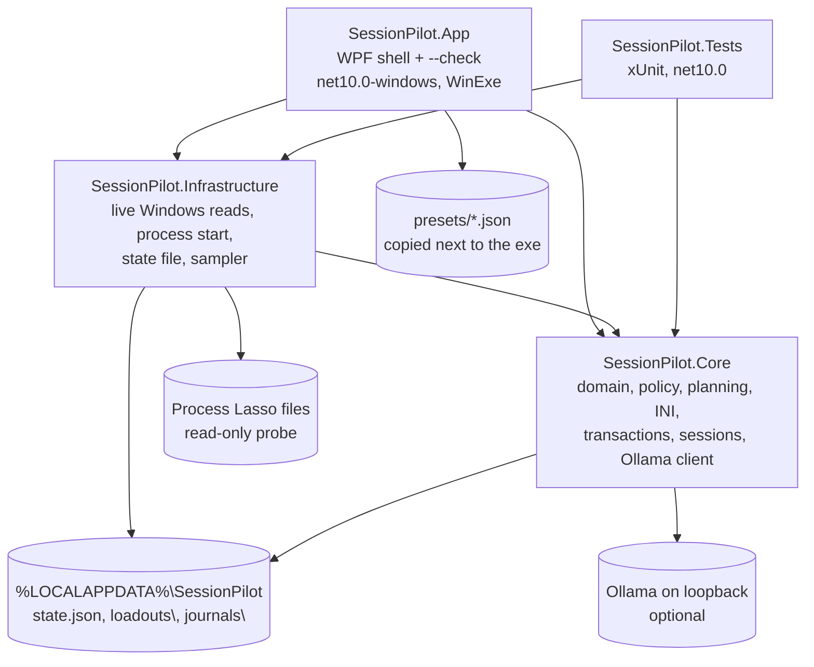
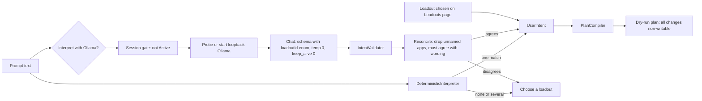

# SessionPilot overview

This document describes what SessionPilot is, what it does, and how it does it. It covers build 1.0.2 and was checked against the source on 2026-10-10. Where the code and an older document disagree, this document follows the code. The requirements blueprint is [`docs/SessionPilot_Project_Specification.txt`](docs/SessionPilot_Project_Specification.txt). Its section 22 maps each requirement to what shipped.

---

## 1. Project goal

**SessionPilot prepares a Windows PC for a specific activity, such as social VR, desktop gaming, software builds, local AI work, or media playback. It does this honestly. It explains what is using the machine, proposes a bounded and reviewable plan, makes changes only through interfaces that have been verified, and never claims a performance gain it has not measured.**

The first motivating case is poor VRChat performance through SteamVR and Virtual Desktop. Process Lasso (by Bitsum) is the intended enforcement engine for process rules. SessionPilot integrates with it as a separate product. It does not replace it, bundle it, or claim affiliation with Bitsum.

### Guiding principles

These are enforced in code, not just stated:

1. **Read before write.** Discovery and diagnostics come first. Every write path stays disabled until a version-tagged before/after export and a reload check prove the file format. Today that means no live write at all.
2. **Uncertainty is visible.** A missing counter is `unavailable`, not zero. A found `prolasso.ini` is a *candidate*, not the active configuration. Five status fields (compiled, persisted, governor, effective, performance) are never merged.
3. **Approval is bound to content.** Approval covers one exact plan hash and one exact file hash, or one exact PID and creation time. Any change invalidates it.
4. **Nothing is invented.** There are no made-up INI keys, CLI switches, registry locations, SteamVR keys, or reload behavior. Unsupported features become guided steps.
5. **No model authority.** A language model can only pick from a fixed set of intents. It never produces commands, paths, INI text, CPU masks, or termination.
6. **Conservative policy.** Built-in policy never changes priority or CPU placement, always preserves ProBalance, never uses Real-time or High priority, and never forces a process to exit.
7. **Works offline without AI.** Presets, diagnostics, and planning need no language model.
8. **Low overhead.** Sampling runs only while the Diagnostics page is open. The model is unloaded after every request and is refused while a session is Active.

### What SessionPilot is not

It is not a scheduler, a "game booster", a RAM cleaner, a registry tweak pack, a service disabler, an autonomous administrator, or an anti-cheat bypass. It does not inject into games, does not patch executables, and does not run shell commands written by an LLM.

---

## 2. Status at a glance

| Area | State in 1.0.2 |
|---|---|
| Read-only discovery (Process Lasso, CPU topology, power plans, processes) | Shipped |
| Rolling process diagnostics with cleanup classification | Shipped |
| Graceful close of one approved process | Shipped |
| Ten built-in loadouts plus user loadout files | Shipped |
| Dry-run plan compiler | Shipped. Every change is non-writable. |
| Deterministic sentence interpreter | Shipped |
| Optional local Ollama interpreter | Shipped |
| Session state machine and confirmed launcher | Shipped, advanced by hand |
| Approval binding and journaled transactions | Shipped for isolated copies. In practice every apply is refused because plans carry no edits. |
| Lossless INI editor, three-way restore analysis, capability notes, historical rule parsers | In Core and tested, not shown in the window |
| Opt-in trigger suggestions | Shipped. Signals are typed by hand, and a trigger only suggests. |
| Power owner record | Shipped. No plan is ever switched. |
| Measurement notes | Shipped. Performance stays `not-measured`. |
| Guided VRChat / SteamVR / Virtual Desktop steps | Shipped |
| Headless `--check` report | Shipped |
| Per-user MSI installer | Shipped (unsigned) |
| Live Process Lasso writes, power switching, VR settings writes, force kill, elevated helper | Deliberately off |
| GPU/disk telemetry, app grouping, measurement import, restore executor, settings/history pages | Not built |

Automated tests: 156 xUnit tests, all passing. A live device test of the installed 1.0.1/1.0.2 builds on Windows 11 with Process Lasso 18.4 present is recorded in [`docs/live-test-plan.md`](docs/live-test-plan.md). The live `prolasso.ini` hash was unchanged before and after.

---

## 3. Architecture

### 3.1 Solution layout



The project is deliberately small: three production assemblies, one test assembly, no plugin system, no database, no reflection framework, and no elevated helper. Shared build settings (`Directory.Build.props`) turn on nullable references, implicit usings, deterministic builds, **warnings as errors**, and set the version (1.0.2). The SDK is pinned to 10.0.303 in `global.json`.

| Project | Responsibility | Notable rule |
|---|---|---|
| **SessionPilot.Core** (`net10.0`) | Domain records and vocabulary, loadout catalog and validator, deterministic interpreter, intent schema validator, plan compiler, capability assessor, historical rule parsers, lossless INI document, transaction coordinator and journals, approval binding, restore planner, session coordinator and launch guard, trigger engine, graceful-close policy, cleanup classifier, CPU math and rolling window, topology parser, power-plan parser and ownership, measurement log, `--check` formatting and redaction, Ollama client/host/launcher | No WPF. Does not touch Process Lasso. The only process it starts is `ollama serve`, and it stops only that process. |
| **SessionPilot.Infrastructure** (`net10.0`) | `LiveDiscovery` (Process Lasso probe, topology through `GetLogicalProcessorInformationEx`, process inventory, `--check` snapshot), `PowerPlanReader` (`powercfg /list`), `ProcessSampler`, `ShellProcessStarter`, `LiveWindowCloser`, `AppStateStore`, `AppPaths` | No write path to Process Lasso, power settings, or VR settings |
| **SessionPilot.App** (`net10.0-windows`, WPF) | `App` (global exception handlers, `--check` entry point, console attach), `MainWindow` (seven pages, thin wiring), `DarkTitleBar` (DWM dark title bar) | Logic that needs tests lives in Core or Infrastructure. The window holds no process logic. |
| **SessionPilot.Tests** (`net10.0`, xUnit) | 156 tests across 13 files | Uses fakes (`IFileReplacer`, `IOllamaHost`, `IOllamaLauncher`, `IProcessStarter`, `ICloseRequest`, fake `HttpMessageHandler`). It never starts real Ollama, `powercfg`, or GUI processes, and never touches `ProgramData\ProcessLasso`. |

### 3.2 Seams (interfaces)

| Interface | Production implementation | Purpose |
|---|---|---|
| `IFileReplacer` | `SameVolumeFileReplacer` | Temp-file-then-`File.Replace` atomic swap. Refuses read-only targets and always cleans up the temp file. |
| `IProcessStarter` | `ShellProcessStarter` | `UseShellExecute` start with `ArgumentList`, so standard Windows escaping applies |
| `ICloseRequest` | `LiveWindowCloser` | `MainWindowHandle` check plus `CloseMainWindow()`. There is no `Kill`. |
| `IOllamaHost` | `ProbingOllamaHost` | Probes `/api/version`. Starts Ollama only when nothing is listening. |
| `IOllamaLauncher` | `OllamaServeLauncher` | Finds `ollama.exe`, starts `serve` with `OLLAMA_KEEP_ALIVE=0`, waits for readiness, and stops the process on failure |
| `IOllamaSession` | `OllamaSession` | Disposing it stops a server that SessionPilot started, and leaves a pre-existing one running |

### 3.3 Hard-coded safety gates

| Gate | Location | Effect |
|---|---|---|
| `LiveApplyPolicy.Enabled = false` | Core/Codecs | `TransactionCoordinator` refuses any target that normalizes to a live candidate path |
| `PlanCompiler` writable check | Core/Planning | Throws if any compiled change is `Writable`. Every change is built with `Writable = false`. |
| `HistoricalRuleParsers.SerializationAllowed => false` | Core/Codecs | Parsers can read historical list shapes but can never serialize them |
| `LoadoutValidator` | Core/Planning | Refuses any loadout, built-in or user, whose `priorityPolicy` or `cpuPlacementPolicy` is not `unchanged`, or whose `proBalancePolicy` is not `preserve` |
| `HistoricalRuleParsers.IsForbiddenPriority` / plan text | Core | Real-time and High priority are refused |
| `ProtectedProcesses` | Core/Codecs | `audiodg`, `dwm`, `csrss`, `lsass`, `services`, `svchost`, `winlogon`, `smss`, Registry, System, Secure System, `MsMpEng`, `SecurityHealthService` are never targets |
| `GracefulClosePolicy` | Core/Cleanup | Requires approval, an optional class, and the same PID plus creation time. It only sends `CloseMainWindow`. |
| `LaunchGuard` | Core/Sessions | Requires a confirmed single-line path or URI. Prompt text is refused as a path or argument. |
| `IntentValidator` + `IntentSchema` | Core/Planning, Core/Ollama | Model JSON must match a closed schema and a known loadout id, with no dangerous keys or strings |
| `OllamaIntentClient.IsLoopback` | Core/Ollama | Only `http` loopback (127.0.0.1, localhost, ::1) is accepted |
| `OllamaSessionGate` | Core/Ollama | No inference while the session is Active. The phase is checked again after the request returns. |
| `TriggerSuggestions` | Core/Automation | Only `hold`, `wait`, or `suggest` can come out. The engine never applies a plan. |
| `PowerOwnership` | Core/Power | One recorded owner. A second owner is refused. `Switched` is always false. |
| `asInvoker` manifest | App | The app never requests elevation |

### 3.4 Status model

Every result keeps five independent fields (`HonestStatus`, `ApplyTransaction`, `CompiledPlan.Stages`). They are shown in a strip at the top of the window:

| Field | Values seen | Meaning |
|---|---|---|
| Compiled | `not compiled`, `compiled (dry run)` | A plan exists |
| Persisted | `not-written`, `verified`, `verify-failed` | The file bytes match the approved bytes |
| Governor | `not-verified`, `not-applicable` | Process Lasso reloaded the change. This is never verified. |
| Effective | `not-observed` | The live Windows setting changed. This is never observed. |
| Performance | `not-measured` | A measured frame-time or FPS effect. This is never claimed. |

The spec's rule is to never treat desired state as effective state, or persisted state as measured state. A file read-back proves persistence, not engine reload. A successful action proves execution, not improved frame times.

### 3.5 Key flows

**Startup (window).** Global handlers for dispatcher, unobserved-task, and AppDomain exceptions are registered first. They show a redacted message and "Nothing was written." Then `state.json` is loaded synchronously (power owner and measurement notes). Discovery runs on a background thread: Process Lasso probe, topology, the loadout catalog (built-in `presets\` plus user `loadouts\`), and the journal scan. `powercfg /list` is awaited after that. The Dashboard shows "Discovering…" until the results arrive.

**`--check` (headless).** `App.OnStartup` sees `--check`, runs `LiveDiscovery.CheckOnce()` (installation probe, topology, one process inventory pass), formats a `CheckSnapshot`, redacts it, writes it to the parent console, and exits with 0. Any exception writes one redacted line and exits with 1. No window opens and no sampling loop starts.

**Diagnostics sampling.** Opening the Diagnostics page starts a 2-second `DispatcherTimer`. Each tick runs `ProcessSampler.Sample` on a worker thread and skips the tick if the previous sample is still running. CPU is the processor-time delta keyed by `PID|creation-time` over the wall interval, shown as a fraction of logical capacity and as logical-core equivalents. Stale keys are pruned. Each row is classified by `CleanupClassifier`. Leaving the page, checking the close-approval box, or closing the window stops the timer.

**Prompt to plan.**



**Approval and apply (isolated copy).** On Plan review, the user enters a path to a copy of an INI and checks approval. The window stores `ApprovalBinding.HashPlan(plan)`, a length-prefixed SHA-256 over the loadout, intent, and every change field, together with the file's SHA-256. On Apply, both hashes are recomputed, and a mismatch invalidates the approval. `TransactionCoordinator.Apply` then runs these steps in order: approved? → target path valid? → not a live candidate? → edits present? → lock `apply.lock` → read baseline and hash → journal `BaselineRecorded` → check the expected hash → parse and apply the edits losslessly → journal the owned values → write the `.baseline` backup → journal `BackupWritten` → re-hash the target → journal `Replacing` → atomic replace → re-read and compare to the intended hash → journal `Completed`. Because compiled plans currently carry no edits, the window always stops at "The plan has no writable edits." Everything after that runs only in tests.

**Startup recovery.** `JournalRecovery.Scan` lists journals whose state is not Completed, Failed, or Refused, plus unreadable journal files. For each one, the target is compared with the baseline and intended hashes, and the result is described ("still matches baseline", "matches intended bytes", "matches neither"). Nothing is rolled back.

**Three-way restore (Core).** `RestorePlanner.Analyze` compares each owned value's baseline, app-written, and current text. If the current value equals the written value, it is restorable. If it equals the baseline, it is already original. Anything else, and any missing or ambiguous key, is a conflict and is left untouched.

**Session and launch.** Begin moves Idle → Discovering. Continue steps through Observing → Planning → AwaitingApproval (it needs a compiled plan to move on) → Preparing → Active → Restoring → Completed. The phases are labels for the user. They do not run discovery or restoration themselves. In Preparing or Active, the user can launch a confirmed path or URI with approved arguments, one per line. The session records what it started as owned. If the user marks the target already running, it is recorded but not owned.

**Graceful close.** The user selects one row on Diagnostics, checks the approval box (which freezes sampling), and presses Request close. The window rejects system/security and protected rows, re-reads the process by PID, compares its creation time, and calls `GracefulClosePolicy.Request`. The possible outcomes are not approved, identity mismatch (approval dropped), no window (not sent), refused, unsaved-work prompt, or requested. "Requested" never means the process exited.

### 3.6 Data and persistence

| Item | Location | Format | Notes |
|---|---|---|---|
| Built-in loadouts | `<install>\presets\*.json` | Loadout schema v1 | Read-only. A broken built-in fails loudly, because it is a packaging bug. `balanced` is required. |
| User loadouts | `%LOCALAPPDATA%\SessionPilot\loadouts\*.json` | Loadout schema v1, unknown fields refused | A bad, unreadable, or colliding file is skipped and listed on the Dashboard |
| App state | `%LOCALAPPDATA%\SessionPilot\state.json` | `{ PowerOwner, Measurements[] }` | Atomic temp-then-replace. An unparsable file is moved to `state.json.unreadable` once. Measurements always reload as `not-measured`. |
| Journals | `%LOCALAPPDATA%\SessionPilot\journals\<id>.json`, `<id>.baseline`, `apply.lock` | JSON journal plus raw bytes | Contains whatever was in the file you chose. Keep it private. |
| Installer registry | `HKCU\Software\SessionPilot` | `InstallFolder`, `InstallFolderPath`, `StartMenuShortcut` | Removed on uninstall |

Every schema carries `schemaVersion` = 1. An unknown version fails validation. Prompts are never written to disk.

### 3.7 Privacy and security posture

- Unprivileged process (`asInvoker`). There is no service, no helper, and no UAC prompt.
- Local only. Nothing is uploaded, and there is no telemetry.
- Redaction (`CheckReport.Redact`) replaces drive paths (either slash direction, through the end of the path), UNC paths, and the current account name of 3 or more characters. It applies to `--check`, error dialogs, apply messages, and recovery text. It is a filter, not a guarantee.
- Process command lines are never collected.
- The Ollama endpoint is loopback only. Responses are capped at 64 KB. Model output is untrusted data.

---

## 4. Project outline

### 4.1 Repository tree

```
LassoPilot/                         (folder keeps its earlier name; product is SessionPilot)
├─ SessionPilot.slnx                solution
├─ Directory.Build.props            version 1.0.2, warnings as errors, nullable, deterministic
├─ global.json                      .NET SDK 10.0.303
├─ dotnet-tools.json                WiX 6.0.2 CLI
├─ README.md                        build, test, install, data, limits
├─ sessionpilot-overview.md         this document
├─ src/
│  ├─ SessionPilot.Core/
│  │  ├─ Automation/                TriggerEngine, TriggerSuggestions, TriggerTracker
│  │  ├─ Cleanup/                   GracefulClosePolicy, ICloseRequest
│  │  ├─ Codecs/                    LiveApplyPolicy, CapabilityAssessor, HistoricalRuleParsers, ProtectedProcesses
│  │  ├─ Diagnostics/               CheckReport (+Redact), FailureText, CleanupClassifier, GuidedWorkflows, CPU/memory/GPU readings, RollingSampleWindow, ProcessIdentity, HonestStatus
│  │  ├─ Discovery/                 InstallationCandidates, ProcessInventory
│  │  ├─ Domain/                    Records (HardwareInventory, Loadout, UserIntent, CompiledPlan, PlanChange, ApplyTransaction, RestoreAnalysis, …), Vocabulary (enums, tokens, limits)
│  │  ├─ Hardware/                  ProcessorTopologyReader
│  │  ├─ Ini/                       IniDocument, IniEdit, ContentHashing
│  │  ├─ Measurement/               MeasurementLog
│  │  ├─ Ollama/                    OllamaIntentClient, IntentSchema, ProbingOllamaHost, OllamaServeLauncher, OllamaSession, OllamaModels, OllamaSessionGate
│  │  ├─ Planning/                  LoadoutCatalog, LoadoutValidator, DeterministicInterpreter, IntentValidator, ApplicationMatcher, PlanCompiler
│  │  ├─ Power/                     PowerPlanParser, PowerOwnership
│  │  ├─ Sessions/                  SessionCoordinator, SessionPhase, LaunchGuard, IProcessStarter
│  │  └─ Transactions/              TransactionCoordinator, SameVolumeFileReplacer, JournalRecovery, RestorePlanner, ApprovalBinding, IsolatedCopyHash, StartupRecovery
│  ├─ SessionPilot.Infrastructure/
│  │  ├─ AppPaths.cs                %LOCALAPPDATA%\SessionPilot paths
│  │  ├─ Diagnostics/ProcessSampler.cs
│  │  ├─ Discovery/                 LiveDiscovery (+NativeTopology P/Invoke), PowerPlanReader
│  │  ├─ Processes/                 ShellProcessStarter, LiveWindowCloser
│  │  └─ State/AppStateStore.cs
│  └─ SessionPilot.App/             App.xaml(.cs), MainWindow.xaml(.cs), DarkTitleBar, app.manifest, app.ico
├─ tests/SessionPilot.Tests/        13 test files, 156 tests
├─ presets/                         10 built-in loadout JSON files
├─ installer/SessionPilot.Installer/ Package.wxs, .wixproj (per-user MSI)
├─ docs/                            see 4.2
├─ tools/build-icon.py              regenerates app.ico and brand/icon-512.png (Pillow, NumPy)
├─ assets/                          icon line art source
├─ brand/                           512 px icon
├─ .github/workflows/test.yml       CI
└─ .cursor/rules/                   agent guardrails and remediation workflow
```

### 4.2 Documentation map

| Document | Content |
|---|---|
| `docs/SessionPilot_Project_Specification.txt` | Requirements blueprint (sections 1–21) and implementation status (section 22) |
| `docs/project-overview.md` | One-paragraph product summary |
| `docs/architecture.md` | Short architecture note |
| `docs/process-lasso.md` | What works and what stays disabled for Process Lasso, and the evidence still missing |
| `docs/compatibility.md` | Probed paths, the observed version, hardware and power sources, VR limits, launcher stubs, Ollama probe timing |
| `docs/presets.md` | Loadout ids and routing rules |
| `docs/transactions.md` | Apply steps, approval, recovery, three-way restore |
| `docs/cleanup.md`, `docs/graceful-close.md` | Cleanup classes, close semantics, and the opt-in manual check |
| `docs/telemetry.md` | Sampling, CPU normalization, unavailable counters |
| `docs/privacy.md` | Local data, redaction scope, Ollama, persisted notes |
| `docs/testing.md` | Test areas and CI triggers |
| `docs/manual-verification.md` | Checks for a person at the machine |
| `docs/live-test-plan.md` | Live test of the installed 1.0.1/1.0.2 builds, findings L1–L13 (all fixed) |
| `docs/refactor-audit.md`, `docs/remediation-plan.md` | Rename audit, follow-up audit, and the completed 8-phase remediation |
| `docs/roadmap.md` | What shipped, and what is blocked on evidence |
| `.cursor/rules/sessionpilot-guardrails.mdc` | Product boundaries every contributor or agent must keep |

### 4.3 Build, test, CI, packaging

- **Build and test:** `dotnet test SessionPilot.slnx` and `dotnet build src/SessionPilot.App/SessionPilot.App.csproj`.
- **CI:** GitHub Actions `test.yml` runs `dotnet test` on `windows-latest` for pushes and PRs to `main`. Docs, Markdown, and `.cursor` changes are skipped. Permissions are read-only, actions are pinned to SHAs, and concurrency cancels stale runs. The installer is not built in CI.
- **Self-contained publish:** `dotnet publish … -r win-x64 --self-contained true`. The English-only satellite resources keep the install at about 132 MB.
- **Installer:** `dotnet tool restore` and `dotnet build installer/…wixproj -c Release`. The build publishes into `artifacts/publish/win-x64` and produces `artifacts/installer/SessionPilot.msi`. The package is per-user, needs no admin rights, and puts a Start Menu shortcut and an uninstall entry with the icon in place. `MajorUpgrade` replaces older versions and refuses downgrades. Uninstall removes the program folder (`RemoveFolderEx`) and the HKCU key, and keeps `%LOCALAPPDATA%\SessionPilot`. A first-page notice states that SessionPilot is not associated with Bitsum and that Process Lasso is required but not installed. The MSI is unsigned.

### 4.4 History

All 22 commits are dated 2026-10-07. The project began as **LassoPilot**, a Process-Lasso-only helper, and was renamed SessionPilot when the scope became workload sessions. After that came a read-only diagnostic shell, VR presets, graceful close, an audit, and an 8-phase remediation (startup resilience, Core correctness and privacy, Ollama lifecycle, infrastructure processes, INI and transaction hardening, UI responsiveness, packaging, cleanups). Then came audit follow-ups, a new icon, 1.0.1, and a live device test whose 13 findings were fixed in 1.0.2. The test count grew from 41 at the rename to 86 at the audit to 156 now.

---

## 5. Complete feature list

Status tags: **[UI]** reachable in the window or `--check`. **[Core]** implemented and unit-tested but not surfaced in the window. **[Off]** deliberately disabled.

### 5.1 Application shell

- [UI] Dark WPF window (1180×760, minimum 880×560) with a DWM dark title bar where supported. Seven keyboard-reachable pages: Dashboard, Diagnostics, Loadouts, Prompt, Plan review, Session, Measurement.
- [UI] Sidebar labels "Unprivileged" and "Live Process Lasso writes are disabled."
- [UI] Status strip: Compiled, Persisted, Governor, Effective, Performance.
- [UI] Global exception handling. Dispatcher, unobserved-task (marshalled to the UI thread), and AppDomain exceptions show a redacted message ending "Nothing was written." The app keeps running where it can.
- [UI] Asynchronous startup with "Discovering…" placeholders. Saved state is loaded before the first await, so nothing recorded during discovery is lost.
- [UI] Per-monitor V2 DPI awareness, long-path awareness, `asInvoker`, and a custom neon icon.

### 5.2 Headless check (`SessionPilot.App.exe --check`)

- [UI] One pass, no sampling loop. It prints: live-write state, installation version, config candidates (listed/present/missing/access-denied), whether the active configuration is assumed (always "no"), hardware summary, process count and access-denied count, the five status fields, notes, and "Sampling loop: not started".
- [UI] Output is redacted. Exit code 0 means written, 1 means failed (with a redacted one-line error). It attaches to the parent console. It runs in about 1 second, even while the window is open.

### 5.3 Discovery

- [UI] Process Lasso probe of exactly three default locations: `Program Files\Process Lasso\ProcessLasso.exe`, `ProcessGovernor.exe`, and `ProgramData\ProcessLasso\config\prolasso.ini`. Each is reported as present, missing, or access-denied. The GUI product version is read. Confidence stays Low and no config is ever "confirmed". There is no registry search.
- [UI] CPU topology through `GetLogicalProcessorInformationEx`, parsed by `ProcessorTopologyReader`: processor groups, logical processors, cores with efficiency class (hybrid detection), caches, and NUMA nodes. Truncated data is recorded as an ambiguity. A failure is "unavailable", not zero. CPU Set data is not collected.
- [UI] Installed power plans from `%SystemRoot%\System32\powercfg.exe /list`, with a 4-second timeout that kills the child process. Parsing works in any display language (GUID, last parenthesized name, trailing `*` for active).
- [UI] Process inventory for `--check`: PID, creation time, name, executable path when allowed, and `ok`/`access-denied`/`exited`.
- [Core] `InstallationCandidates.Assemble` builds `ProcessLassoInstallation` with limitations ("first present file is not the active configuration", access-denied, missing).
- [Core] `ApplicationMatcher`: executable-name collision marking, and selection only of a single confirmed, non-colliding identity.

### 5.4 Diagnostics and telemetry

- [UI] Process table: Name, PID, Created, Access, CPU ("x.x% of logical capacity (y.yy logical cores)"), Working set (bytes), and cleanup Class.
- [UI] 2-second interval, on a worker thread, overlapping ticks skipped, collector duration shown, and the sample count shown out of 30.
- [UI] CPU keyed by PID plus creation time, so PID reuse cannot borrow an old delta. The first sample has no delta ("unavailable"). Negative deltas are discarded. The previous-CPU map is pruned every tick.
- [UI] Fixed labels: "GPU engine counters are unavailable. Working set is not memory pressure. High CPU does not authorize a close."
- [UI] Sampling keeps the last 30 samples and continues while the page is open. It pauses when the page is left or close approval is checked, and stops when the window closes. The first sample after a pause has no CPU delta, so time away is not counted as CPU use.
- [Core] `RollingSampleWindow<T>` (capacity 30, oldest dropped), `CpuMath`, `ProcessorTimeSeries`, `MemoryReadings`, `GpuReadings.Unavailable`, `ProcessIdentity.IsSame`/`IsPidReuse`.

### 5.5 Cleanup advisor and graceful close

- [UI] Classification of every sampled process:
  - **SystemOrSecurity**: the protected list (see §3.3).
  - **PossibleUnsavedWork**: Word, Excel, PowerPoint, Notepad, Notepad++, VS Code, Visual Studio, Cursor, Rider, IntelliJ.
  - **Unknown**: everything else. Python, Node, Chrome, Edge, Firefox, Brave, Windows Terminal, cmd, PowerShell, pwsh, and editors are explicitly "not a blanket cleanup target". Observed CPU "does not authorize a close".
  - **ProtectedParticipant**: supported by the classifier when the caller marks a participant. The window does not mark any yet.
- [UI] Request close of exactly one selected process. It requires the approval checkbox, an Unknown or PossibleUnsavedWork class, and a known creation time. The process is re-read and its PID and creation time compared before sending. It sends `CloseMainWindow` only. Results are reported as written: no window, refused, prompt visible, or requested. "Requested" does not mean exited. If a save prompt appears, it belongs to the application.
- [Off] `Kill`, process-tree close, and force termination.

### 5.6 Loadouts (presets)

- [UI] Ten built-in loadouts (§6), listed by display name. Selecting one records a manual selection, shows its summary and notes, and compiles a plan.
- [UI] "Clear manual selection" releases the trigger override.
- [UI] User loadouts from `%LOCALAPPDATA%\SessionPilot\loadouts`. A user file may not reuse a built-in id. Invalid JSON, validation failures, unreadable files, and id collisions are skipped and listed with `name: reason`.
- [Core] The validator enforces schema version 1, an id of letters, digits, and hyphens up to 64 characters, known objective/session/power/background tokens, priority `unchanged`, placement `unchanged`, ProBalance `preserve`, and roles limited to game, compositor, streaming, audio, and companion. Unknown JSON fields are refused.
- [Core] `Clone` and `Save` for user loadouts. Saving always writes the conservative policy values. Built-ins are read-only.

### 5.7 Natural-language intent

- [UI] **Deterministic interpreter** ("Interpret"). Whole-word, case-insensitive matching with optional `s`/`es` plurals.
  - VRChat plus crowded or diagnostic → `vrchat-diagnostic`. Virtual Desktop → `vrchat-social`. VRChat plus SteamVR → `vrchat-steamvr`. Otherwise it matches word groups for local AI, build, media, batch, interactive development, gaming, and balanced/restore.
  - Zero matches or several matches → "Choose a loadout." Nothing is invented.
  - Derives objective (frame-time/throughput/responsive/quiet keywords, otherwise the loadout default), session mode (persistent wording, otherwise temporary), and power (battery or quiet → saver, "performance" → performance, otherwise the loadout default). Flags a restore suggestion.
  - Requested applications: VRChat, SteamVR, Virtual Desktop, and quoted names (path-like names dropped), up to 16.
  - Warns that throttling, kill/terminate, and Real-time priority are not available from a sentence. Warnings appear under the explanation.
- [UI] **Ollama interpreter** ("Interpret with Ollama", with a model name box):
  - With an empty model box, it lists installed model names from the Ollama `manifests` folder (`OLLAMA_MODELS` or `%USERPROFILE%\.ollama\models`) and never downloads one.
  - It is refused while the session is Active. After the reply, it re-checks the phase and does not compile if the session became Active. The button is disabled while a request runs, and the request is cancelled when the window closes.
  - Endpoint `http://127.0.0.1:11434`, loopback http only.
  - Probe of `/api/version` with a 5-second limit (Windows takes about 2 seconds to refuse a loopback connection). 2xx means use it. Any other HTTP reply means something else is listening, so nothing is started. A refused connection means start `ollama serve` (found in `%LOCALAPPDATA%\Programs\Ollama` or fully qualified PATH entries) with `OLLAMA_KEEP_ALIVE=0`, wait up to 20 seconds for readiness, and stop it if it never becomes ready. A server SessionPilot started is stopped after the request. One that was already running is left alone.
  - The chat request uses `stream:false`, `keep_alive:0`, `temperature:0`, `format` set to the intent JSON schema with `loadoutId` restricted to an `enum` of catalog ids, and a system prompt listing each id and summary. Request timeout is 120 seconds and the response cap is 64 KB.
  - Validation: JSON object with only the 7 schema properties, `schemaVersion` exactly integer 1, a known loadout id, valid enum tokens, and application names that are non-path-like, at most 128 characters, and at most 16 in number. It rejects dangerous keys (shell, command, cmd, exec, path, ini, registry, affinity, mask, service, terminate, kill, …) and dangerous strings (`cmd.exe`, `powershell`, `HKEY_`, `prolasso.ini`, `reg add`).
  - Reconciliation: application names not present in the prompt are dropped, with a warning. If the deterministic rules matched a different loadout, nothing is compiled and both choices are shown.
  - The prompt is not stored.

### 5.8 Plan compiler (dry run)

- [UI] `PlanCompiler.Compile(intent, loadout)` produces a `CompiledPlan` with a fresh id, summary, changes, warnings, five stage states, and an optional manual JSON preview. Plan review lists each change as target, existing → proposed, rationale, support status, and `writable=False`.
- Changes generated:
  - `probalance-preserve` (NoChange), `priority-unchanged` (NoChange, Real-time and High forbidden), and `placement-unchanged` (Deferred, with a note on whether topology was complete).
  - When the loadout offers Performance Mode: one `performance-<role>` per game/compositor role. With no confirmed identity it is "Unconfirmed" (ManualPreviewOnly).
  - When the loadout offers Efficiency Mode off: one `efficiency-<role>` per participant role (KeyObservedFormatUnverified, Medium risk).
  - When the loadout requires explicit workers and none are given: `workers-required` (BlockedByPolicy).
  - [Core] Worker requests: protected names are refused. Only `exclude-from-probalance` with a justification of at least 8 characters reaches "would append to OocExclusions after codec verification" (DocumentedFormatUnverified). It is still not writable.
  - A warning when the power preference is not balanced ("intent only").
- [Core] Confirmed identities, a capability scan, and hardware can be passed in. The window does not pass them yet, so participants appear as Unconfirmed and worker loadouts show `workers-required`.
- [Core] Manual Process Lasso rules JSON preview (`ruleSets[].performanceMode`), labeled "Unverified preview. Not an export from Process Lasso."
- The compiler throws if any change is writable.

### 5.9 Approval, transactions, recovery, restore

- [UI] Approval checkbox on Plan review, bound to the plan hash and the isolated copy's SHA-256. Recompiling or changing the file invalidates it. An unreadable file unchecks it ("Nothing was written.").
- [UI] "Apply to isolated copy" runs the coordinator against the path entered. Live candidate paths are refused. With current plans it reports "The plan has no writable edits."
- [Core] Full journaled apply (§3.5) with application lock, baseline/backup/re-hash/atomic replace/verify, owned-value capture, and journal states Preparing → BaselineRecorded → BackupWritten → Replacing → Completed, plus Failed and NeedsReconciliation. A read-only target is refused before any temp file exists.
- [UI] Startup recovery: incomplete and unreadable journals are described on the Dashboard. Nothing is rolled back.
- [Core] `RestorePlanner` three-way analysis: restorable values, already-original values, and conflicts (external edit, missing key, ambiguous key). It does not perform a whole-file restore.

### 5.10 Lossless INI document (Core)

- [Core] Parses UTF-8 (with or without BOM), UTF-16 LE (with or without BOM), UTF-16 BE (with BOM), and a Latin-1 fallback. Keeps line endings per line, blank lines, comments, unrecognized lines, and section/key order. Re-serializes byte-identical when nothing changed.
- [Core] `Observe()` reports key presence, emptiness, value kind (boolean, integer, comma list, semicolon list, mixed, other), and length, without copying values.
- [Core] `Apply(edits)` edits existing keys only. It refuses: missing keys (no new keys created), ambiguous duplicates, duplicate edits, line breaks, values the file encoding cannot store, existing inline comments, and new values that would read as an inline comment. It keeps the original spacing around `=`.
- [Core] SHA-256 content hashing.

### 5.11 Process Lasso capability knowledge (Core)

- [Core] `CapabilityAssessor` reports, for each rule family, the support status, evidence, and block reason: Performance Mode membership (ManualPreviewOnly), Efficiency Mode (KeyObservedFormatUnverified or Unsupported), CPU priority (Ambiguous: conflicting historical list shapes), ProBalance exclusions (DocumentedFormatUnverified), CPU Sets (Deferred), watchdogs (Unsupported: inconsistent published example), and affinity (BlockedByPolicy). `LiveWriteEnabled` is false for every family.
- [Core] `HistoricalRuleParsers`: `OocExclusions` comma lists (a semicolon is treated as ambiguous) and both `DefaultPriorities` shapes (semicolon records and comma table, including two-word priorities). `SerializationAllowed` is false. Real-time and High are flagged as forbidden.
- [Off] Every live write: performance mode, Efficiency Mode, priority, affinity, CPU Sets, watchdogs, ProBalance exclusions, governor restart or reload, and JSON import.

### 5.12 Session coordination and launch

- [UI] Session page with a phase display, Begin, and Continue. Each refusal says why ("Press Begin to start a session.", "Compile a plan before preparing.", "Press Begin to start again.").
- [Core] Thirteen phases (Idle, Discovering, Observing, Planning, AwaitingApproval, Preparing, Active, Restoring, Completed, Cancelled, Failed, PartiallyApplied, RecoveryRequired) with an explicit transition table. `BlocksAnotherSession` enforces one session at a time.
- [UI] Confirmed launch: path or URI, a "confirmed" checkbox, an "already running, do not take ownership" checkbox, and approved arguments one per line. Allowed only in Preparing or Active. Prompt text is refused as a path or argument. Arguments use `ArgumentList` escaping. The result shows the owned and already-running counts and the note that relaunch does not restore unsaved documents, tabs, remote jobs, or exact state.
- [Core] A readiness timeout marks a launch as failed and not owned. The window does not run a readiness check yet.

### 5.13 Triggers (opt-in suggestions)

- [UI] Dashboard: an opt-in checkbox, a box for signaled loadout ids (one per line), and Suggest.
- [Core] The engine holds when not opted in or when a manual selection exists. It picks the highest-precedence signal (`vrchat-diagnostic` > `vrchat-social` > `vrchat-steamvr` > `desktop-gaming` > `development-local-ai` > `development-build-heavy` > `development-interactive` > `media-playback` > `background-batch` > `balanced`). It waits through a 5-second debounce and a 20-second minimum dwell, and a change in the top signal restarts the dwell. After that it suggests. After a session ends with a non-balanced loadout active, it suggests `balanced` once a 45-second exit grace has passed. It says so when signals contain no known id. Output is limited to hold, wait, or suggest.
- [UI] Every result ends with "A suggestion is not an applied plan." Nothing is applied and no elevation is requested.

### 5.14 Power

- [UI] Read-only list of installed plans with the active one marked.
- [UI] Record Process Lasso or Windows as the single power owner. A second, different owner is refused. "Clear recorded owner" resets it. The owner persists across restarts in `state.json`. Every message ends with "Nothing was switched."
- [Off] Switching a power plan, and writing application power profiles.

### 5.15 Guided VR workflows

- [UI] Dashboard cards, all guided-only, none writing files:
  - **VRChat**: avatar performance rank, max shown avatars, hide-beyond distance, graphics profile, MSAA, mirrors (from the public configuration window).
  - **SteamVR**: record what the overlay shows. No settings keys are known.
  - **Virtual Desktop**: record the quality, bitrate, refresh, and codec shown in the overlay. There is no settings API.

### 5.16 Measurement

- [UI] Record a run with a label and confounders. Every run shows `not-measured` and the note that a desktop PresentMon file would describe desktop presentation, not headset frame delivery. "Clear measurement notes" is available. Notes persist in `state.json` and always reload as `not-measured`.

### 5.17 State and resilience

- [UI] A corrupt `state.json` is moved aside once and defaults are used. An unreadable one uses defaults. A corrupt, empty, or locked journal and a bad user loadout are each skipped and listed. Startup continues in every case.
- [UI] Unreadable isolated copies, malformed target paths, and read-only targets all fail with a sentence and nothing written.

### 5.18 Packaging

- [UI] Per-user MSI (see §4.3) with upgrade, downgrade refusal, a Bitsum notice page, icon, Start Menu shortcut, and uninstall cleanup that keeps user data.

---

## 6. Built-in loadouts

All ten keep `priorityPolicy: unchanged`, `cpuPlacementPolicy: unchanged`, `proBalancePolicy: preserve`, and `sessionMode: temporary`.

| Id | Display name | Objective | Power | Background | Perf Mode offer | Eff. Mode off offer | Explicit workers | Participant roles |
|---|---|---|---|---|---|---|---|---|
| `balanced` | Balanced | restore | balanced | preserve | no | no | no | none |
| `vrchat-steamvr` | VRChat via SteamVR | frame-time-consistency | performance | preserve | yes | yes | no | game, compositor, streaming, audio, companion |
| `vrchat-social` | VRChat social | frame-time-consistency | performance | preserve | yes | yes | no | game, compositor, streaming, audio, companion |
| `vrchat-diagnostic` | VRChat crowded diagnostic | frame-time-consistency | performance | preserve | yes | yes | no | game, compositor, streaming, audio, companion |
| `desktop-gaming` | Desktop gaming | frame-time-consistency | performance | preserve | yes | yes | no | game |
| `development-interactive` | Interactive development | responsiveness | balanced | preserve | no | no | no | none |
| `development-build-heavy` | Build-heavy development | throughput | balanced | explicit-workers-only | no | no | yes | none |
| `development-local-ai` | Local AI development | throughput | balanced | explicit-workers-only | no | no | yes | none |
| `media-playback` | Media playback | quiet-balanced | balanced | preserve | no | no | no | none |
| `background-batch` | Background batch | throughput | balanced | explicit-workers-only | no | no | yes | none |

Vocabulary: objectives `frame-time-consistency`, `responsiveness`, `throughput`, `quiet-balanced`, `restore`. Session modes `temporary` and `persistent`. Power `performance`, `balanced`, `saver`. Background `preserve` and `explicit-workers-only`.

---

## 7. Deliberately not done

These are product boundaries, not backlog items. Each stays off until the named evidence exists:

| Not done | Unblocked by |
|---|---|
| Live Process Lasso writes of any rule family | A version-tagged before/after Export Rules JSON and INI pair for that family, plus a reload check that does not restart the governor |
| Elevated helper | Only if a verified codec needs one. The live `prolasso.ini` was not writable by a standard user. |
| Real-time or High priority, affinity, CPU Sets, SMT tricks | Out of policy. CPU Sets may become a hardware-aware experiment later. |
| Power-plan switching | One owner plus an export showing Process Lasso's power rules |
| SteamVR, VRChat, or Virtual Desktop settings writes or API calls | A supported, version-gated interface |
| Force termination or process-tree kill | Never part of default automation |
| Headset frame delivery as a measured result | Validated compositor/headset timing. Desktop PresentMon must be labeled desktop presentation. |
| Downloading Ollama or a model, remote LLM providers | Not planned. Only loopback is accepted. |
| Game injection, memory writes, anti-cheat bypass, registry packs, RAM cleaning, service disabling | Never |

---

## 8. Known gaps and limitations (as of 1.0.2)

1. **Plans have no writable edits.** The approval/apply pipeline is complete but only exercised by tests. Every apply in the window is refused.
2. **No identity confirmation UI.** Plans never receive confirmed participants, workers, capabilities, or hardware, so participant rows stay "Unconfirmed" and worker loadouts show `workers-required`.
3. **Session phases are manual labels.** They do not trigger discovery, observation, preparation, or restoration. Session state and owned launches live in memory only. There is no readiness probe and no shutdown at session end. Cancelled, PartiallyApplied, and RecoveryRequired cannot be reached from the window.
4. **Triggers are typed by hand.** There is no process-based workload detection, and the exit-grace path is not fed by the window.
5. **Plan details not shown.** Plan warnings, risk, evidence, verification strategy, stage states, and the manual JSON preview exist on the plan but are not displayed.
6. **Restore analysis has no executor or UI.** Recovery only describes.
7. **Telemetry scope.** There is no GPU engine, disk, commit, paging, publisher, parent, or window data, and no grouping of multi-process applications. `ProtectedParticipant` is never assigned by the window.
8. **Discovery scope.** Only the default Process Lasso locations are probed. A copy installed elsewhere is not found, and the active configuration is never confirmed.
9. **Launcher stubs.** A launch that hands off to another process (Windows 11 `notepad.exe`, many game launchers) owns the stub, not the window that appears.
10. **Unsigned installer**, tested only on Windows 11 x64.

---

## 9. Glossary

| Term | Meaning here |
|---|---|
| Loadout | A portable policy for an activity. It is not a Process Lasso profile directory and not a promise of higher FPS. |
| Participant | A process the activity needs (game, compositor, streaming, audio, companion). It is never a cleanup target. |
| Candidate | A discovered path that may be the configuration. It is never assumed active. |
| Isolated copy | A user-chosen copy of an INI outside the Process Lasso folder. It is the only allowed write target. |
| Owned value / owned launch | Something SessionPilot itself wrote or started, and therefore may restore or stop |
| Governor | Process Lasso's enforcement process (`ProcessGovernor.exe`) |
| ProBalance | Process Lasso's automatic restraint algorithm, which SessionPilot always preserves |
| Guided-only | A capability delivered as instructions for the user, because no verified interface exists |
| Not-measured | The default and only performance status until real measurement import exists |
